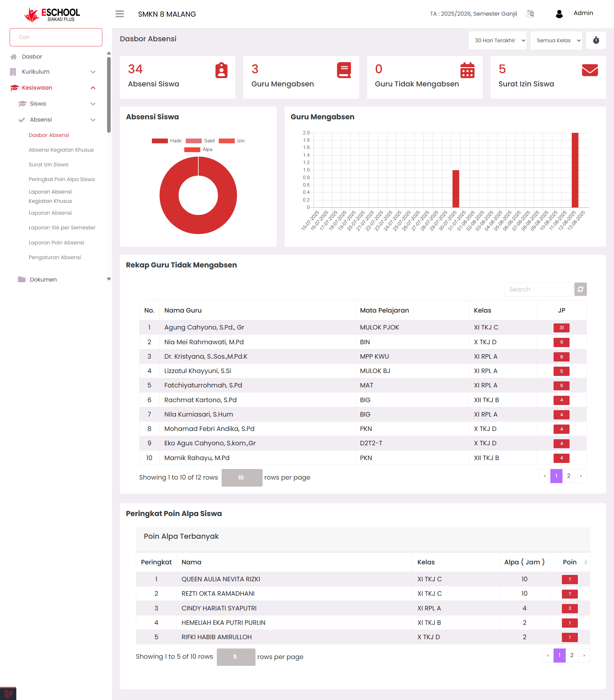

# Dashboard Absensi

<figure><figcaption></figcaption></figure>

Halaman **Dasbor Absensi** di E-SCHOOL Siakad Plus dirancang untuk memberikan gambaran menyeluruh tentang kondisi kehadiran di sekolah dalam satu tampilan terintegrasi. Data yang ditampilkan mencakup jumlah absensi siswa, guru yang mengabsen, guru yang belum mengabsen, serta jumlah surat izin siswa. Informasi ini dilengkapi dengan grafik visual dan tabel rekap sehingga pemantauan dapat dilakukan secara cepat, akurat, dan real-time.

***

**Kapan Menggunakan Fitur Ini?**

* Memantau kondisi absensi saat jam belajar berlangsung.
* Mengecek guru yang aktif mengabsen dan yang belum melakukan absensi.
* Mengidentifikasi siswa dengan poin alpa tertinggi untuk tindak lanjut pembinaan.
* Menyajikan laporan singkat untuk rapat harian atau mingguan.

***

**Navigasi dan Filter**

Pengguna dapat mempersempit atau memperluas data yang ditampilkan dengan:

* **Filter Rentang Waktu** – _Hari ini_, _7 Hari Terakhir_, _Bulan Ini_, hingga _Bulan Lalu_.
* **Filter Kelas** – menampilkan data absensi pada kelas tertentu atau seluruh kelas sekaligus.
* **Auto Refresh** – ikon ⏱ yang memungkinkan pembaruan data otomatis setiap 10 detik tanpa memuat ulang halaman.

***

**Komponen Utama Dasbor**

1. **Kartu Statistik** – menampilkan total:
   * Absensi Siswa
   * Guru Mengabsen
   * Guru Tidak Mengabsen
   * Surat Izin Siswa
2. **Grafik Visual** – _donut chart_ untuk distribusi status kehadiran siswa (_Hadir, Sakit, Izin, Alpa_) dan _bar chart_ untuk aktivitas absensi guru per tanggal.
3. **Tabel Rekap** – terdiri dari:
   * **Rekap Guru Tidak Mengabsen** – daftar guru, mata pelajaran, kelas, dan total JP.
   * **Peringkat Poin Alpa Siswa** – siswa dengan jam alpa terbanyak beserta poinnya.

***

**Aksi & Interaksi**

* Klik ikon ⏱ untuk mengaktifkan atau menonaktifkan _auto-refresh_ 10 detik.
* Ubah filter waktu dan kelas untuk fokus pada data tertentu.
* Gunakan tabel peringkat untuk menentukan siswa prioritas pembinaan.

***

**Manfaat Fitur Ini**

* **Kesiswaan** → Memantau kepatuhan guru dan siswa terhadap absensi.
* **Wali Kelas** → Mengetahui siswa yang membutuhkan pembinaan khusus.
* **Pimpinan Sekolah** → Melihat tren kehadiran untuk pengambilan keputusan cepat.

***

**Tips Penggunaan**

* Aktifkan _auto-refresh_ saat memantau absensi di jam masuk/pulang sekolah agar cepat mendeteksi ketidakhadiran.
* Periksa **Rekap Guru Tidak Mengabsen** di awal jam pelajaran dan hubungi guru terkait jika diperlukan.
* Gunakan **Peringkat Poin Alpa** sebagai bahan diskusi rapat wali kelas atau BK setiap pekan.

***

Jika Anda membutuhkan bantuan lebih lanjut, hubungi kami melalui [halaman Bantuan eSchool](https://www.eschool.ac.id/#contact-us).
