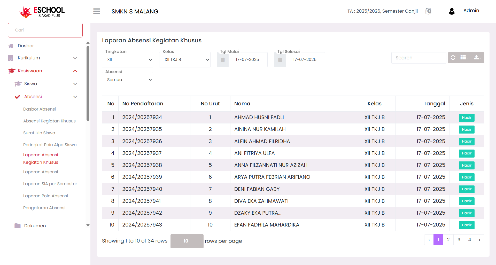

# Laporan Absensi Kegiatan Khusus

<figure><figcaption></figcaption></figure>

Halaman **Laporan Absensi Kegiatan Khusus** di E-SCHOOL Siakad Plus dirancang untuk mencatat dan memantau kehadiran siswa dalam kegiatan **non-pelajaran.** Fitur ini memisahkan absensi kegiatan khusus dari absensi rutin harian dan per mata pelajaran, sehingga pelaporan menjadi lebih spesifik dan tertata.

***

#### **Kapan Menggunakan Fitur Ini?**

* Saat ingin melihat daftar siswa yang hadir atau tidak hadir dalam acara/kegiatan khusus.
* Untuk membuat laporan kehadiran yang terpisah dari absensi pembelajaran reguler.
* Sebagai bahan evaluasi partisipasi siswa dalam program non-akademik.
* Untuk mendokumentasikan keaktifan siswa pada kegiatan tertentu.

***

#### **Navigasi & Filter Data**

**Filter Data**

<figure><figcaption></figcaption></figure>

Pengguna dapat memfilter laporan berdasarkan:

* **Tingkatan** → Pilih semua tingkatan atau kelas tertentu contoh: (X, XI, XII, XIII).
* **Kelas** → Mempersempit data berdasarkan kelas tertentu.
* **Jenis Absensi** → Menyaring data berdasarkan status kehadiran: Hadir, Tidak Hadir, Sakit, Izin, atau Alpa.
* **Tanggal Mulai & Tanggal Selesai** → Menentukan periode pencatatan kegiatan.

Filter ini memudahkan pencarian data presensi sesuai periode dan kelompok yang diinginkan.

**Pencarian Cepat**

<figure><figcaption></figcaption></figure>

* **Search Bar** → Cari siswa berdasarkan nama, nomor pendaftaran.

***

#### **Tabel Data Absensi**

Setiap baris pada tabel memuat informasi:

| Kolom              | Keterangan                                   |
| ------------------ | -------------------------------------------- |
| **No**             | Nomor urut data.                             |
| **No Pendaftaran** | ID unik siswa.                               |
| **No Urut**        | Nomor urut dalam kelas.                      |
| **Nama**           | Nama lengkap siswa.                          |
| **Kelas**          | Asal kelas siswa.                            |
| **Tanggal**        | Tanggal kegiatan khusus.                     |
| **Jenis**          | Status kehadiran (Hadir, Sakit, Izin, Alpa). |

***

#### **Fitur Tambahan**

* **Search Bar** → Memudahkan pencarian data cepat.
* **Ekspor Data** → Unduh laporan dalam format **Excel (.xlsx)** atau **PDF (.pdf).**
* **Pagination** → Navigasi antar halaman untuk melihat lebih dari 10 entri per halaman.

***

#### **Manfaat Fitur Ini**

| Pengguna          | Manfaat Khusus                                                          |
| ----------------- | ----------------------------------------------------------------------- |
| **Guru Kegiatan** | Mendata peserta aktif kegiatan di luar kelas secara akurat.             |
| **Wali Kelas**    | Mengetahui keaktifan siswa dalam program non-akademik.                  |
| **Kesiswaan**     | Membuat laporan disiplin & keaktifan siswa lintas kegiatan sekolah.     |
| **Manajemen**     | Mendapatkan insight kehadiran siswa dalam konteks kegiatan kelembagaan. |

***

#### **Tips Penggunaan**

* Gunakan **filter tanggal** untuk menampilkan laporan sesuai event yang diinginkan.
* Unduh laporan PDF untuk **arsip resmi sekolah**.
* Pantau siswa yang sering tidak hadir untuk intervensi **BK/kesiswaan**.
* Gunakan filter **Jenis Absensi** jika hanya ingin fokus pada siswa yang absen atau hadir.
