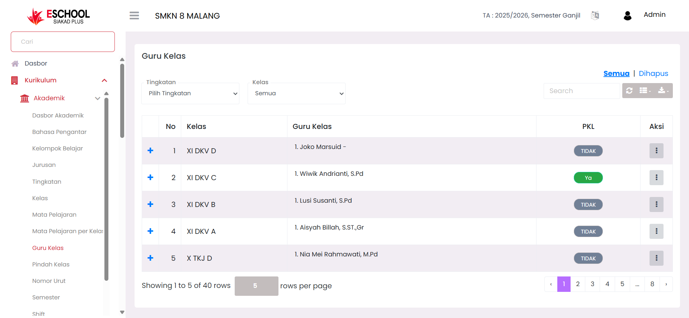

# Guru Kelas

Halaman **Guru Kelas** di E-SCHOOL Siakad Plus dirancang untuk mengelola dan memantau penugasan wali kelas beserta daftar guru pengampu mata pelajaran di setiap kelas. Fitur ini membantu administrasi sekolah, kurikulum, dan pihak manajemen untuk memastikan setiap kelas memiliki wali kelas yang jelas, serta pembagian tugas guru terdata secara rapi dan mudah diakses.

<figure><figcaption></figcaption></figure>

***

#### Navigasi dan Filter

Pengguna dapat mempersempit tampilan data menggunakan:

* **Filter Tingkatan** → Memilih jenjang kelas tertentu contoh: (X, XI, XII).
* **Filter Kelas** → Menampilkan data untuk kelas spesifik atau seluruh kelas.
* **Tab "Semua" & "Dihapus"** → Mengatur tampilan antara data aktif dan yang sudah dihapus.
* **Search Bar** → Mencari guru atau kelas secara cepat.

***

#### Komponen Utama Tabel Guru Kelas

Tabel berisi informasi sebagai berikut:

| Kolom          | Keterangan                                                                 |
| -------------- | -------------------------------------------------------------------------- |
| **No**         | Nomor urut data.                                                           |
| **Kelas**      | Nama kelas yang diawasi.                                                   |
| **Guru Kelas** | Nama wali kelas beserta gelar.                                             |
| **PKL**        | Status apakah kelas sedang melaksanakan Praktik Kerja Lapangan (Ya/Tidak). |
| **Aksi**       | Menu untuk mengedit atau menghapus data guru kelas.                        |

***

#### Aksi & Interaksi

<figure><figcaption></figcaption></figure>

* **Tambah Guru Kelas** → Menentukan wali kelas baru dan mengatur guru pengampu mata pelajaran.
* **Edit Data** → Mengubah wali kelas atau guru pengampu.
* **Hapus Data** → Menghapus penugasan wali kelas (dengan konfirmasi peringatan).
* **Kelola Guru Mata Pelajaran** → Menambahkan atau mengganti guru pengampu per mata pelajaran.
* **Status PKL** → Centang jika kelas sedang melaksanakan PKL.

***

#### Manfaat Fitur Ini

* **Kurikulum** → Memastikan pembagian tugas mengajar terdistribusi dengan tepat.
* **Wali Kelas** → Memudahkan koordinasi dengan guru mata pelajaran.
* **Manajemen Sekolah** → Mendapatkan gambaran lengkap struktur pengampu setiap kelas.

***

#### Tips Penggunaan

* Gunakan filter **Tingkatan** saat mengatur guru di awal tahun ajaran.
* Tandai status **PKL** untuk mempermudah pelacakan jadwal dan absensi.
* Pastikan data guru mata pelajaran selalu diperbarui setiap terjadi rotasi atau mutasi guru.

***

Jika Anda membutuhkan bantuan lebih lanjut, hubungi kami melalui [halaman Bantuan eSchool](https://www.eschool.ac.id/#contact-us).
