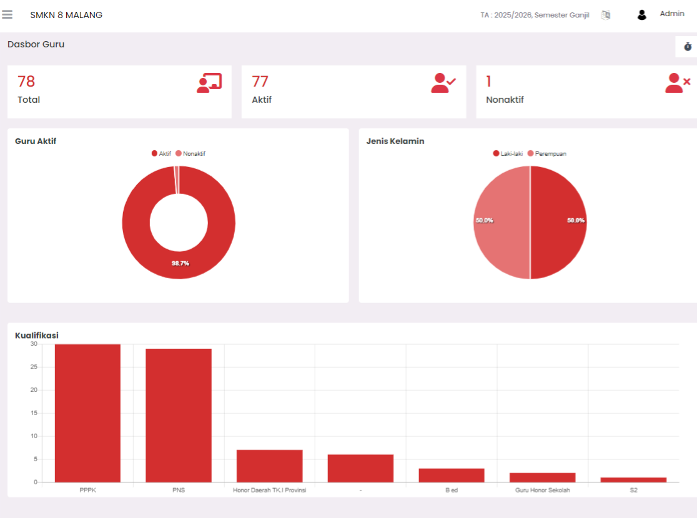

# Dashboard Guru

<figure><figcaption></figcaption></figure>

**Dasbor Guru** merupakan pusat informasi visual yang menyajikan data statistik terkini mengenai tenaga pendidik di sekolah. Menu ini membantu admin dan manajemen sekolah untuk memahami komposisi dan status guru secara cepat dan efisien.

#### Tujuan Utama

Menampilkan **ringkasan data guru** dalam bentuk grafik dan angka untuk mendukung keputusan strategis dan operasional.

***

#### Komponen Dasbor

**Total, Aktif, Nonaktif**

* **Total**: Jumlah seluruh guru yang terdaftar dalam sistem.
* **Aktif**: Guru yang saat ini masih menjalankan tugasnya.
* **Nonaktif**: Guru yang sudah tidak aktif, baik karena cuti, pensiun, mutasi, atau alasan lainnya.

**Status Guru Aktif**

Disajikan dalam bentuk **diagram donat** yang membandingkan persentase guru aktif dan nonaktif secara visual.

> Misal: 98,7% guru aktif – menunjukkan tingkat keaktifan yang tinggi.

**Jenis Kelamin**

Statistik jumlah guru berdasarkan gender, disajikan dalam **diagram lingkaran**:

* Laki-laki
* Perempuan

> Data ini berguna untuk melihat proporsi representasi gender di institusi pendidikan.

**Kualifikasi Guru**

Ditampilkan dalam **diagram batang horizontal**, mencakup:

* **PPPK** (Pegawai Pemerintah dengan Perjanjian Kerja)
* **PNS** (Pegawai Negeri Sipil)
* **Honor Daerah TK I/Provinsi**
* **Guru Honor Sekolah**
* **B.Ed / S2 / Lainnya**

> Visual ini membantu mengetahui latar belakang dan profesionalitas tenaga pengajar secara agregat.

***

#### Manfaat Praktis

* **Monitoring Cepat**: Cukup buka dasbor, semua info inti langsung terlihat.
* **Keputusan SDM**: Mudah merencanakan rekrutmen, pelatihan, atau distribusi guru.
* **Evaluasi Proporsi**: Cek keseimbangan gender atau kualifikasi untuk kebijakan berbasis data.

***

#### Akses Menu

1. Login sebagai Admin.
2. Navigasi ke sidebar kiri > **Guru > Dasbor**.
3. Data akan tampil otomatis sesuai semester dan tahun ajaran aktif.

***

Jika Anda membutuhkan bantuan lebih lanjut, hubungi kami melalui [halaman Bantuan eSchool](https://www.eschool.ac.id/#contact-us).
