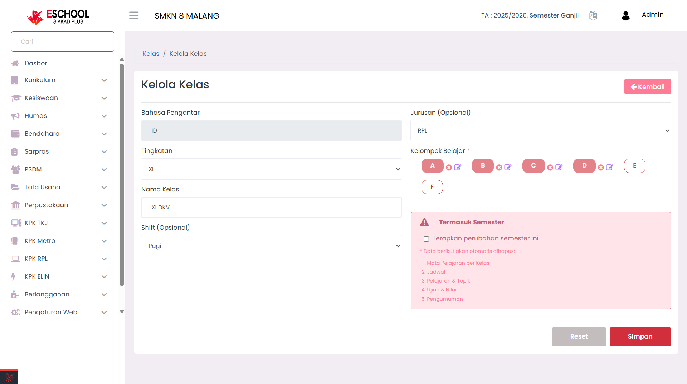
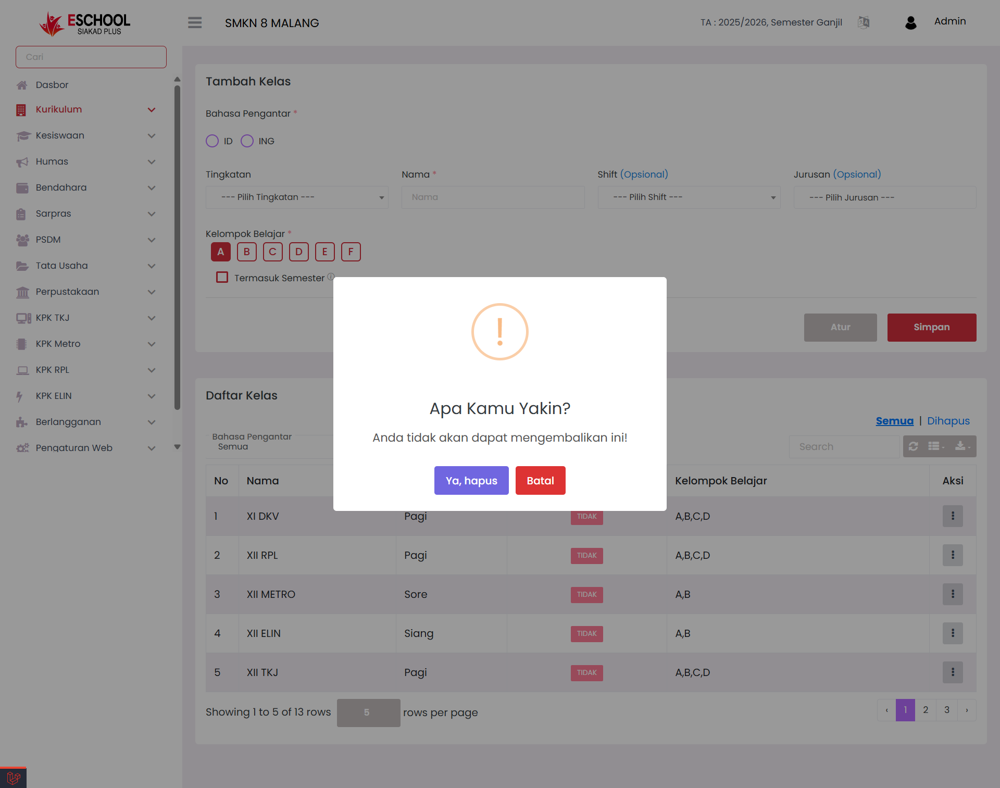

# Kelas

<figure><figcaption></figcaption></figure>

Halaman Tambah Kelas pada E-SCHOOL Siakad Plus memudahkan admin dalam membuat, mengedit, atau menghapus data kelas sesuai tingkatan, jurusan, shift, dan kelompok belajar. Fitur ini memungkinkan manajemen kelas yang akurat dan mudah diperbarui kapan saja.

***

### 🧾 Kapan Menggunakan Fitur Ini?

* Menambahkan kelas baru untuk tahun ajaran atau semester baru.
* Mengatur shift kelas (pagi/sore/siang) dan jurusan.
* Menentukan kelompok belajar dalam satu kelas.
* Mengubah data kelas yang sudah ada (edit).
* Menghapus kelas yang tidak lagi digunakan.

***

### 🛠️ Panduan Pengisian Form Tambah Kelas

1. **Bahasa Pengantar (Wajib)**\
   Pilih bahasa pengantar utama kelas:
   * **ID**: Bahasa Indonesia
   * **ING**: Bahasa Inggris
2. **Tingkatan (Wajib)**\
   Pilih tingkatan kelas seperti X, XI, atau XII.
3. **Nama Kelas (Wajib)**\
   Masukkan nama kelas, contoh: `XI DKV` atau `XII RPL`.
4. **Shift (Opsional)**\
   Pilih waktu belajar jika ada perbedaan shift:
   * Pagi
   * Siang
   * Sore
5. **Jurusan (Opsional)**\
   Pilih jurusan sesuai dengan struktur akademik sekolah.
6. **Kelompok Belajar (Wajib)**\
   Centang minimal satu atau lebih kelompok belajar yang aktif dalam kelas tersebut, misal: A, B, C.
7. **Termasuk Semester (Opsional)**\
   Centang opsi ini jika kelas tersebut digunakan dalam semester berjalan.

✅ Klik **Simpan** untuk menambahkan kelas ke daftar. Klik **Atur** jika ingin mengatur lebih lanjut.

***

### 🧾 Aksi Tambahan dalam Daftar Kelas

<figure><figcaption></figcaption></figure>

Pada kolom **Aksi** di tabel Daftar Kelas, tersedia tombol dengan ikon tiga titik (...), yang memiliki dua fungsi penting:

* **✏️ Edit Kelas** – Memperbarui informasi kelas yang sudah terdaftar.

<figure><figcaption></figcaption></figure>

***

* **🗑️ Hapus Kelas** – Menghapus kelas dari sistem jika sudah tidak digunakan.

<figure><figcaption></figcaption></figure>

***

### 💡 Tips Tambahan

* Gunakan nama kelas yang konsisten dengan nomenklatur sekolah.
* Kelompok belajar berguna untuk pembagian siswa dalam mapel tertentu atau pengelompokan evaluasi.
* Pastikan tidak menghapus kelas yang masih digunakan dalam jadwal, penugasan, atau ujian.

***

Jika Anda membutuhkan bantuan lebih lanjut, hubungi kami melalui [halaman Bantuan eSchool](https://www.eschool.ac.id/#contact-us).
