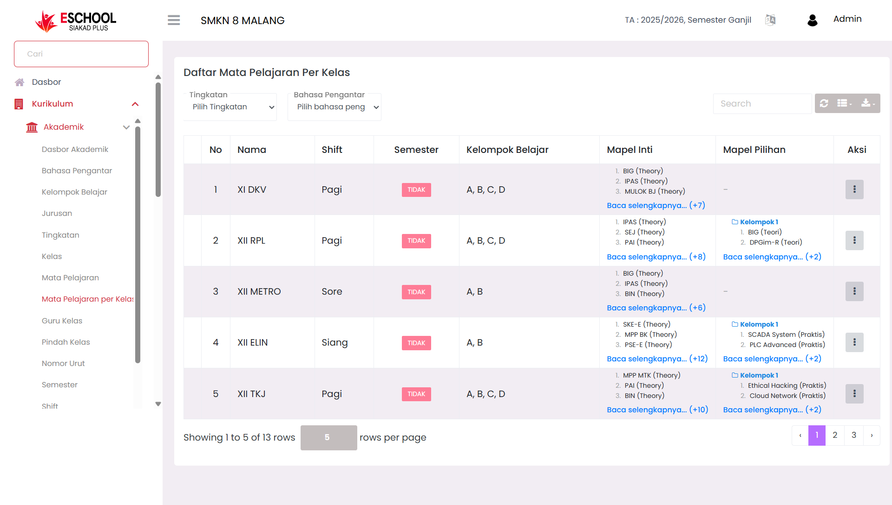
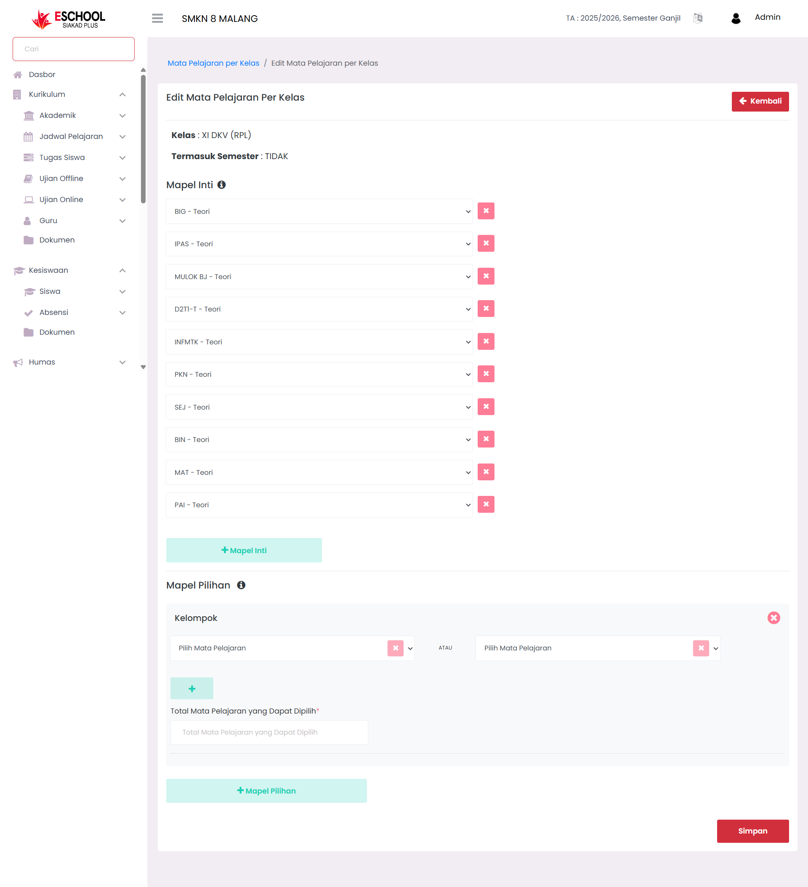

# Mata Pelajaran Per Kelas

<figure><figcaption></figcaption></figure>

Halaman **Mata Pelajaran per Kelas** di eSchool Siakad Plus digunakan untuk menentukan, mengubah, dan memantau daftar mata pelajaran yang berlaku pada setiap kelas, lengkap dengan pembagian **mapel inti** dan **mapel pilihan**. Data ini menjadi acuan utama dalam pengaturan jadwal, penugasan, dan ujian.

***

### &#x20;Kapan Menggunakan Fitur Ini?

* Menambahkan daftar mata pelajaran untuk kelas tertentu.
* Mengedit mata pelajaran yang sudah ditetapkan dalam suatu kelas.
* Mengelompokkan mapel inti dan mapel pilihan sesuai kurikulum.
* Memperbarui daftar mapel akibat perubahan struktur pembelajaran.

***

### &#x20;Panduan Penggunaan

#### 1. **Filter Data**

<figure><figcaption></figcaption></figure>

Gunakan filter di bagian atas tabel:

* **Tingkatan** → Pilih jenjang kelas (X, XI, XII, XIII).
* **Bahasa Pengantar** → Pilih bahasa pengantar (`ID` atau `ING`).

#### 2. **Daftar Mata Pelajaran per Kelas**

Tabel menampilkan informasi:

* **No** → Nomor urut.
* **Nama** → Nama kelas.
* **Shift** → Waktu belajar (Pagi, Siang, Sore).
* **Semester** → Status semester aktif atau tidak.
* **Kelompok Belajar** → Daftar kelompok dalam kelas.
* **Mapel Inti** → Mata pelajaran wajib untuk kelas tersebut.
* **Mapel Pilihan** → Mata pelajaran yang dapat dipilih siswa.

#### 3. **Aksi (⋮)**

Pada setiap baris tabel terdapat tombol **aksi titik tiga (⋮)** yang berisi:

* &#x20;**Edit** → Membuka form **Edit Mata Pelajaran per Kelas** untuk menambah, menghapus, atau mengubah mapel inti dan mapel pilihan.
* _(Jika tersedia di sistem, aksi hapus akan disesuaikan oleh admin sekolah.)_

***

### &#x20;Form Edit Mata Pelajaran per Kelas

<figure><figcaption></figcaption></figure>

Di halaman **Edit** tersedia:

* **Informasi Kelas** → Menampilkan nama kelas, jurusan, dan status semester.
* **Mapel Inti** → Tambahkan atau hapus mapel wajib dengan tombol `+ Mapel Inti` atau ikon ❌ untuk menghapus.
* **Mapel Pilihan** → Atur kelompok mapel pilihan beserta jumlah maksimal yang dapat dipilih siswa.

Klik **Simpan** untuk menerapkan perubahan.

***

### &#x20;Fitur Pencarian

<figure><figcaption></figcaption></figure>

Gunakan kolom **Search** di pojok kanan atas tabel untuk menemukan data kelas tertentu secara cepat berdasarkan nama kelas atau isi daftar mapel.

***

### &#x20;Tips Penggunaan

* Pastikan semua mapel yang ditambahkan sudah ada di daftar **Mata Pelajaran** utama agar dapat dipilih.
* Gunakan pembagian mapel inti dan pilihan untuk fleksibilitas kurikulum.
* Lakukan pengecekan berkala pada daftar mapel agar tetap sesuai dengan kebijakan akademik sekolah.

***

Jika Anda membutuhkan bantuan lebih lanjut, hubungi kami melalui [halaman Bantuan eSchool](https://www.eschool.ac.id/#contact-us).
