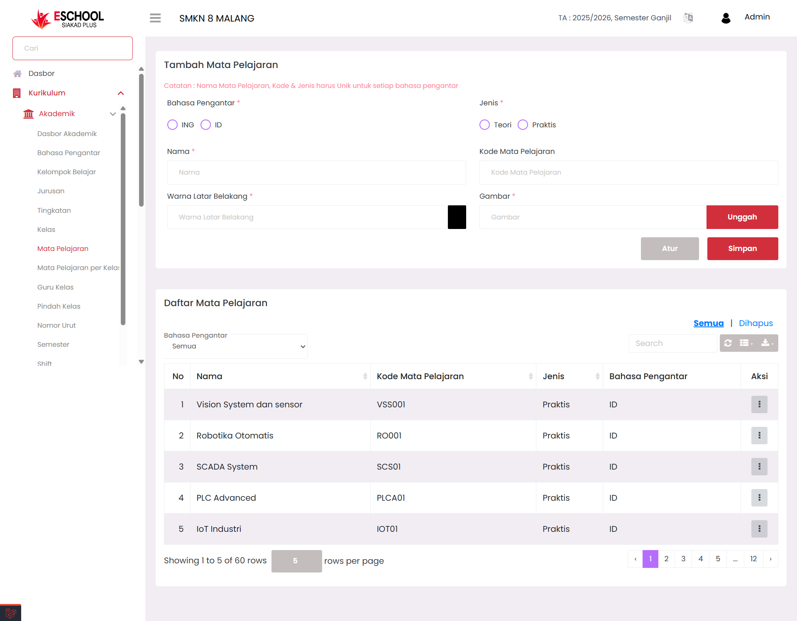
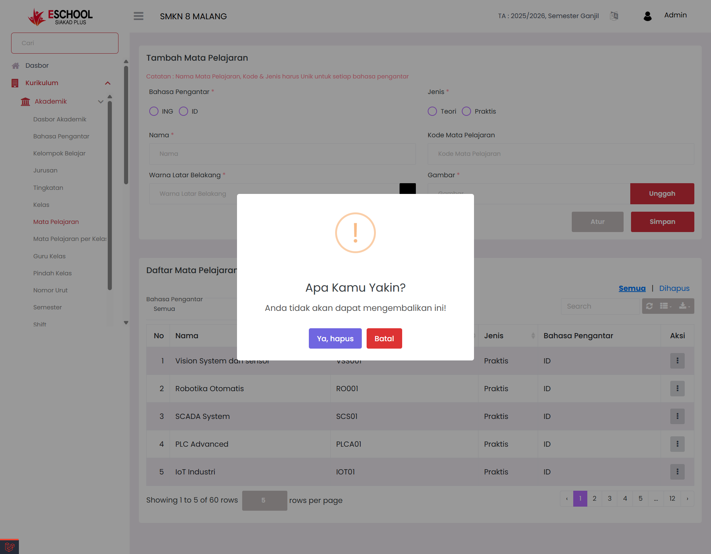

# Mata Pelajaran

Halaman **Mata Pelajaran** di eSchool Siakad Plus digunakan untuk membuat, memperbarui, dan menghapus daftar mata pelajaran yang digunakan dalam sistem sekolah. Setiap mata pelajaran diatur secara unik berdasarkan **nama**, **kode**, **jenis** (teori/praktis), **bahasa pengantar**, **warna identitas**, dan **gambar representatif**. Data ini digunakan sebagai dasar dalam pengaturan kelas, jadwal, guru, dan ujian.

<figure><figcaption></figcaption></figure>

***

### &#x20;Kapan Menggunakan Fitur Ini?

* Saat membuat daftar mata pelajaran baru untuk kurikulum yang digunakan.
* Ketika ingin mengedit informasi mata pelajaran, seperti nama atau jenisnya.
* Untuk menghapus mata pelajaran yang tidak lagi dipakai.
* Menyediakan data agar bisa digunakan pada pengaturan kelas, jadwal, guru, dan ujian.

***

### Panduan Pengisian Form Tambah Mata Pelajaran

1. **Bahasa Pengantar (Wajib)**\
   Pilih salah satu:
   * `ID` = Bahasa Indonesia
   * `ING` = Bahasa Inggris
2. **Nama Mata Pelajaran (Wajib)**\
   Tulis nama lengkap mata pelajaran, contoh: `Robotika Otomatis`.
3. **Kode Mata Pelajaran (Wajib)**\
   Gunakan kode unik, seperti: `RO001`, `SCADA01`, dll.
4. **Jenis (Wajib)**\
   Pilih salah satu jenis mata pelajaran:
   * `Teori`
   * `Praktis`
5. **Warna Latar Belakang (Wajib)**\
   Pilih warna untuk tampilan visual mata pelajaran.
6. **Gambar (Wajib)**\
   Unggah ikon atau ilustrasi pendukung untuk identitas visual pelajaran.

&#x20;Klik **Simpan** untuk menambahkan mata pelajaran ke dalam daftar. Klik **Atur** untuk pengaturan lanjutan jika diperlukan.

***

### &#x20;Aksi Edit &  Hapus

Setiap baris pada tabel **Daftar Mata Pelajaran** memiliki kolom **Aksi** dengan dua pilihan:

<figure><figcaption></figcaption></figure>

***

* **Edit**: Membuka pop-up untuk memperbarui data mata pelajaran.

<figure><figcaption></figcaption></figure>

***

* **Hapus**: Menampilkan peringatan sebelum data dihapus sementara.\
  &#x20;_"Anda tidak akan dapat mengembalikan ini!"_

<figure><figcaption></figcaption></figure>

***

### Fitur Pencarian & Pengelolaan Data Dihapus

#### Pencarian Data

Gunakan kolom **Search** di pojok kanan atas tabel untuk mencari data secara cepat berdasarkan:

* Nama Mata Pelajaran

#### Lihat Data yang Dihapus Sementara

Jika kamu menghapus data pelajaran, data tersebut tidak langsung hilang.\
Klik **"Dihapus"** di kanan atas untuk melihat daftar pelajaran yang telah dihapus sementara.

#### Aksi Pemulihan atau Hapus Permanen

Pada tampilan _Dihapus_, klik tombol aksi titik tiga (**⋮**) untuk:

* &#x20;**Pulihkan** → Mengembalikan data ke daftar aktif.
* &#x20;**Hapus Permanen** → Menghapus data selamanya dari sistem.

***

### &#x20;Tips Tambahan

* Gunakan nama dan kode konsisten untuk menghindari duplikasi data.
* Hindari mengubah jenis pelajaran setelah digunakan dalam jadwal aktif.
* Hapus hanya jika pelajaran sudah tidak digunakan pada kelas atau penilaian.
* Cek folder “Dihapus” jika ada data penting yang tidak sengaja terhapus.
* Upload gambar dengan resolusi proporsional agar tampilan tetap rapi.

***

Jika Anda membutuhkan bantuan lebih lanjut, hubungi kami melalui [halaman Bantuan eSchool](https://www.eschool.ac.id/#contact-us).
