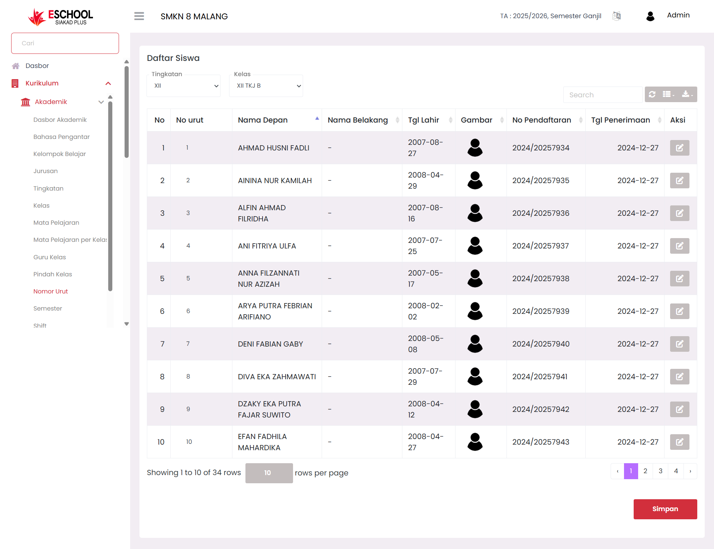

# Nomor Urut

**Halaman Nomor Urut** di E-SCHOOL Siakad Plus digunakan untuk mengelola dan menyunting urutan siswa dalam kelas. Fitur ini memudahkan admin atau wali kelas dalam mengatur nomor absen siswa sesuai kebutuhan administrasi sekolah, terutama untuk keperluan presensi, ujian, atau laporan lainnya.

<figure><figcaption></figcaption></figure>

***

#### **Fungsi Utama**

* Menampilkan daftar siswa berdasarkan tingkatan dan kelas.
* Menyunting nomor urut langsung dari tabel secara cepat dan efisien.
* Mendukung pencarian cepat siswa berdasarkan nama atau data lainnya.
* Ekspor data nomor urut ke file dengan opsi pengunduhan.

***

#### **Kapan Fitur Ini Digunakan?**

* Saat melakukan perubahan urutan siswa (misal karena mutasi atau pengelompokan ulang).
* Saat menyusun daftar kehadiran atau absensi.
* Untuk menyesuaikan urutan nama dalam dokumen resmi kelas.
* Ketika mengelola kelas baru tiap awal tahun ajaran.

***

#### **Komponen yang Tersedia**

* **Dropdown Tingkatan & Kelas:** Untuk memilih data siswa berdasarkan kelas.
* **Kolom Interaktif “No Urut”:** Dapat diedit dengan menekan ikon pensil pada kolom status.
* **Tabel Dinamis:** Menampilkan nama siswa, tanggal lahir, nomor pendaftaran, dan gambar.
* **Aksi Edit:** Untuk mengubah nomor urut siswa.
* **Search & Export:** Mencari siswa spesifik dan mengekspor data sesuai kebutuhan.
