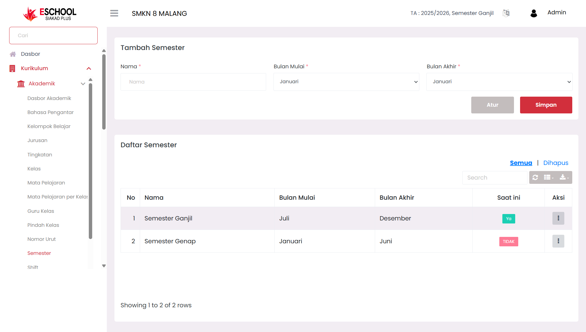

# Semester

Halaman _Semester_ di E-SCHOOL Siakad Plus dirancang untuk mengelola periode pembelajaran tahunan dalam sistem akademik sekolah. Admin dapat menambahkan, mengedit, dan menghapus data semester lengkap dengan rentang bulan awal hingga akhir semester serta mengatur semester aktif yang sedang berlangsung.

<figure><figcaption></figcaption></figure>

***

#### Kapan Menggunakan Fitur Ini?

* Saat tahun ajaran baru dimulai dan perlu menentukan semester aktif.
* Saat merevisi atau menyesuaikan periode semester berdasarkan kebijakan sekolah.
* Untuk validasi semester yang sedang berjalan dalam laporan akademik dan absensi.

***

#### Navigasi dan Komponen

**Form Tambah Semester**

* Nama Semester (mis. "Semester Ganjil", "Semester Genap")
* Bulan Mulai dan Bulan Akhir → dipilih dari dropdown bulan Januari hingga Desember.
* Tombol _Simpan_ dan _Atur_ untuk manajemen entri.

**Daftar Semester**

* Tabel berisi daftar semester yang telah ditambahkan, berikut informasi bulan mulai dan akhir.
* Kolom “Saat Ini” untuk menandai semester yang sedang berjalan (_Ya_ atau _Tidak_).
* Aksi Edit & Hapus yang muncul melalui tombol tiga titik (⋮).
* Tab navigasi “Semua” dan “Dihapus” untuk melihat semester aktif maupun yang telah dihapus.

***

#### Manfaat Fitur Ini

* **Admin Kurikulum** → Menentukan semester berjalan dan rentang waktunya sebagai dasar seluruh aktivitas akademik.
* **Pimpinan Sekolah** → Memastikan sistem mengikuti siklus semester resmi.
* **Guru/Wali Kelas** → Menyesuaikan rencana pelajaran dan penilaian berdasarkan semester aktif.

***

#### Aksi & Interaksi

* Klik **Simpan** setelah mengisi nama dan bulan semester.
* Gunakan opsi **Edit** untuk memperbarui bulan mulai/akhir atau status aktif.
* Klik **Hapus** lalu konfirmasi apabila ingin menghapus data semester (tidak dapat dikembalikan).

***

#### Tips Penggunaan

* Pastikan hanya **satu semester** yang aktif dalam satu waktu.
* Tambahkan semester baru sebelum memulai kegiatan belajar mengajar agar sinkronisasi jadwal berjalan lancar.
* Gunakan status "Saat Ini" sebagai acuan validasi sistem absensi dan penilaian otomatis.

***

Jika Anda membutuhkan bantuan lebih lanjut, hubungi kami melalui [halaman Bantuan eSchool](https://www.eschool.ac.id/#contact-us).
