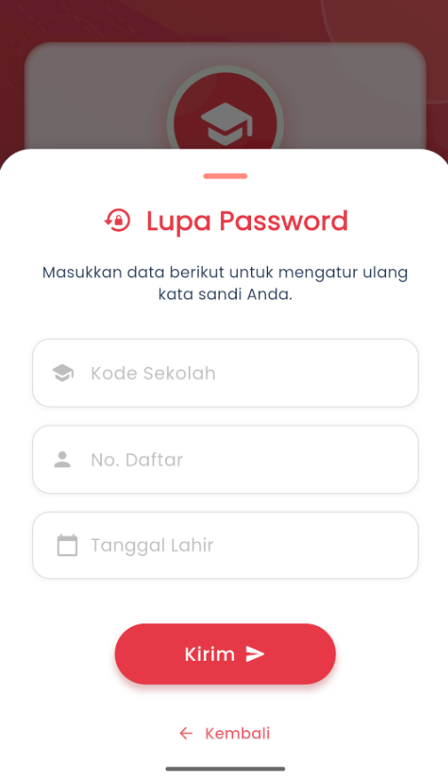

# Lupa Password

### **Lupa Kata Sandi**

#### Reset Password Akun eSchool Anda dengan Mudah dan Aman

Menu **Lupa Kata Sandi** dirancang untuk membantu pengguna yang tidak dapat mengakses akun eSchool Mobile karena lupa kata sandi. Prosesnya cepat, aman, dan dapat dilakukan langsung dari aplikasi.

<figure><figcaption></figcaption></figure>

#### Langkah-Langkah Reset Sandi

1. Masukkan alamat email yang telah terdaftar di sistem eSchool pada kolom yang tersedia.
2. Klik tombol **"Kirim Tautan Reset"**.
3. Sistem akan mengirimkan **tautan verifikasi melalui email** Anda.
4. Buka email, lalu klik tautan tersebut untuk mengatur ulang kata sandi Anda.

#### ⚠️ Penting Diperhatikan

* Pastikan Anda menggunakan **alamat email yang valid dan terdaftar** di akun eSchool.
* Jika tidak menemukan email masuk, **periksa folder Spam atau Promosi**.
* Tautan reset hanya berlaku dalam **waktu terbatas**, jadi lakukan proses reset sesegera mungkin.

Masih Mengalami Kendala?

Jika Anda belum menerima email atau mengalami kesulitan dalam proses reset, silakan hubungi **admin sekolah Anda** atau kunjungi halaman [**Bantuan eSchoo**](https://www.eschool.ac.id/#contact-us)**l** untuk mendapatkan dukungan lebih lanjut.
