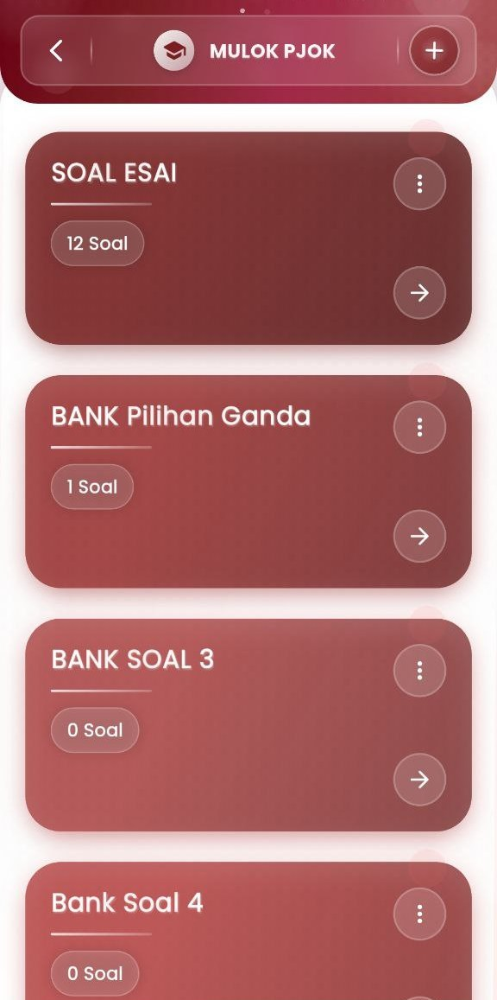

# Bank Soal

### **Bank Soal — Manajemen Soal Digital yang Terstruktur dan Efisien**

Menu **Bank Soal** merupakan fitur utama yang dirancang untuk membantu pendidik dalam mengelola, menyusun, dan menyimpan berbagai jenis soal secara sistematis dalam satu tempat. Dengan tampilan yang intuitif dan desain profesional, fitur ini memberikan kemudahan dalam pembuatan dan pengelompokan soal sesuai kebutuhan pembelajaran, baik untuk latihan mandiri, kuis, hingga ujian sekolah.

<figure><figcaption></figcaption></figure> <figure><figcaption></figcaption></figure> <figure><figcaption></figcaption></figure> <figure><figcaption></figcaption></figure>

#### **Tipe Soal yang Didukung :**

Untuk menjawab kebutuhan evaluasi yang beragam, sistem Bank Soal menyediakan **5 tipe soal** yang dapat dipilih saat membuat soal baru:

1. **Pilihan Ganda**\
   Soal dengan beberapa opsi jawaban, di mana hanya satu yang benar. Dilengkapi dengan fitur penandaan jawaban benar dan pemberian umpan balik khusus per opsi.
2. **Essay (Uraian Panjang)**\
   Digunakan untuk mengukur kemampuan analisis, penalaran, dan keterampilan menulis siswa. Jawaban bersifat terbuka dan dinilai secara manual oleh guru.
3. **Benar / Salah**\
   Soal berbentuk pernyataan, di mana siswa hanya memilih antara dua opsi: _Benar_ atau _Salah_. Cocok untuk menguji pemahaman konsep dasar secara cepat.
4. **Jawaban Singkat**\
   Menilai pemahaman siswa melalui respon berupa kata atau frasa singkat. Jawaban dapat dinilai otomatis jika sudah diatur kunci jawaban tunggal atau ganda.
5. **Numerik**\
   Soal yang jawabannya berupa angka atau nilai numerik. Ideal untuk mata pelajaran seperti Matematika, Fisika, Akuntansi, atau Ekonomi

#### **Fitur Manajemen Soal**

* **Kategorisasi Bank Soal**\
  Setiap bank soal dapat dibuat berdasarkan topik, mata pelajaran, bab, atau jenis ujian. Ini memudahkan pengelompokan dan pencarian soal.
* **Pembuatan Soal yang Fleksibel**\
  Formulir pembuatan soal menyediakan kolom lengkap: nama soal, pertanyaan utama, catatan tambahan, pengaturan poin, dan tipe soal yang bisa dipilih sesuai kebutuhan.
* **Materi Pendukung (opsional)**\
  Guru dapat menambahkan file atau referensi multimedia untuk memperkaya konteks soal.
* **Edit & Duplikasi Soal**\
  Soal yang tersimpan bisa dengan mudah diperbarui atau digandakan untuk digunakan kembali di sesi ujian yang berbeda.
* **Penilaian Otomatis & Manual**\
  Untuk soal objektif seperti pilihan ganda, benar/salah, dan numerik, penilaian dilakukan otomatis. Sementara esai dan jawaban singkat bisa dinilai manual agar lebih fleksibel.

#### **Manfaat Bank Soal untuk Guru & Lembaga Pendidikan**

* Mempercepat proses pembuatan ujian dan latihan siswa.
* Menjamin konsistensi dan kualitas soal.
* Meningkatkan efisiensi dalam pelaksanaan evaluasi.
* Menyediakan rekam jejak dan dokumentasi soal secara sistematis.
* Dapat digunakan lintas semester, lintas mata pelajaran, dan lintas jenjang.

***

Jika Anda membutuhkan bantuan lebih lanjut, hubungi kami melalui [halaman Bantuan eSchool](https://www.eschool.ac.id/#contact-us).

\
