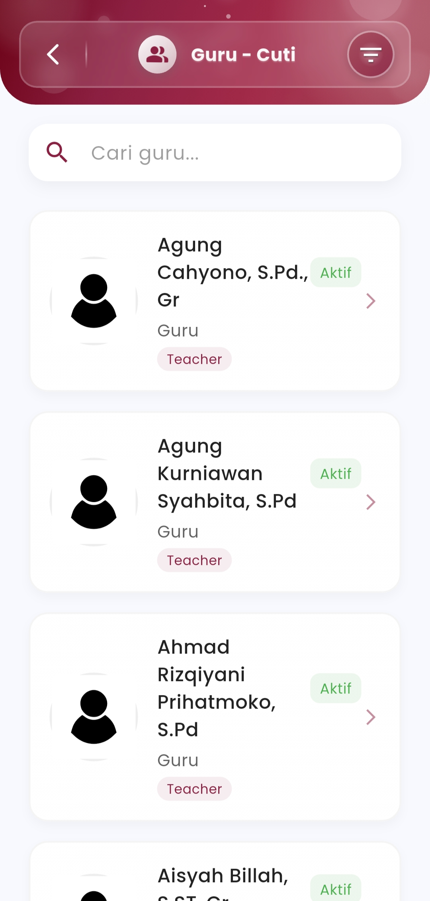
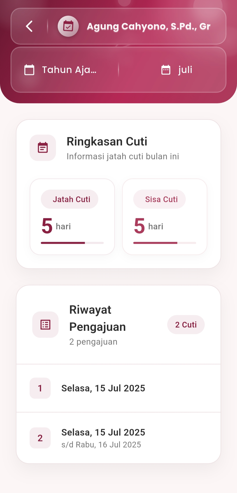

# Cuti Guru

### **Cuti Guru**

#### Kelola Hak Cuti Guru dengan Mudah, Akurat, dan Terpusat

Menu **Cuti Guru** dirancang untuk mempermudah admin sekolah dalam mengelola hak cuti tahunan guru secara digital. Dengan antarmuka yang intuitif dan informatif, seluruh proses—dari melihat jatah cuti, memantau sisa hari, hingga merekap riwayat pengajuan—dapat dilakukan dengan cepat dan efisien.

<figure><figcaption></figcaption></figure> <figure><figcaption></figcaption></figure>

#### **Fitur Utama**

**Ringkasan Hak Cuti**

Pantau status jatah cuti setiap guru dalam satu tampilan:

* **Jatah Cuti** per bulan/tahun yang tersedia
* **Sisa Cuti** yang belum digunakan
* Visualisasi progres cuti dengan indikator progresif

Tampilan ini memberi admin wawasan real-time terhadap penggunaan hak cuti seluruh tenaga pendidik.

**Riwayat Pengajuan**

Rekap seluruh pengajuan cuti guru yang tersimpan secara otomatis, menampilkan:

* Tanggal cuti awal hingga akhir
* Jumlah hari yang digunakan
* Nomor urut pengajuan
* Riwayat untuk setiap guru yang dapat ditelusuri kembali kapan pun

**Daftar Guru Interaktif**

Lihat dan cari guru secara instan melalui daftar guru aktif yang ditampilkan secara sistematis, lengkap dengan:

* Status keaktifan (Aktif/Nonaktif)
* Identitas lengkap guru
* Label peran “Teacher”
* Akses cepat ke detail cuti per individu

***

Jika Anda membutuhkan bantuan lebih lanjut, hubungi kami melalui [halaman Bantuan eSchool](https://www.eschool.ac.id/#contact-us)
