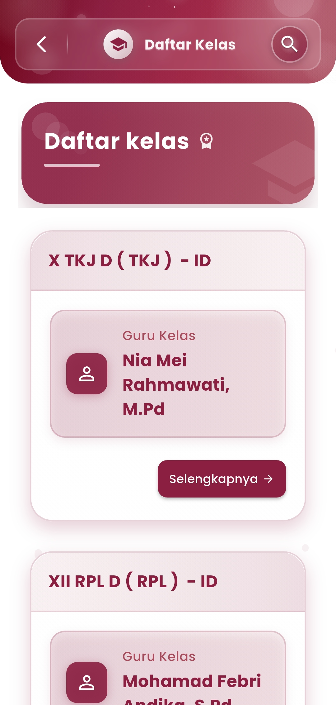
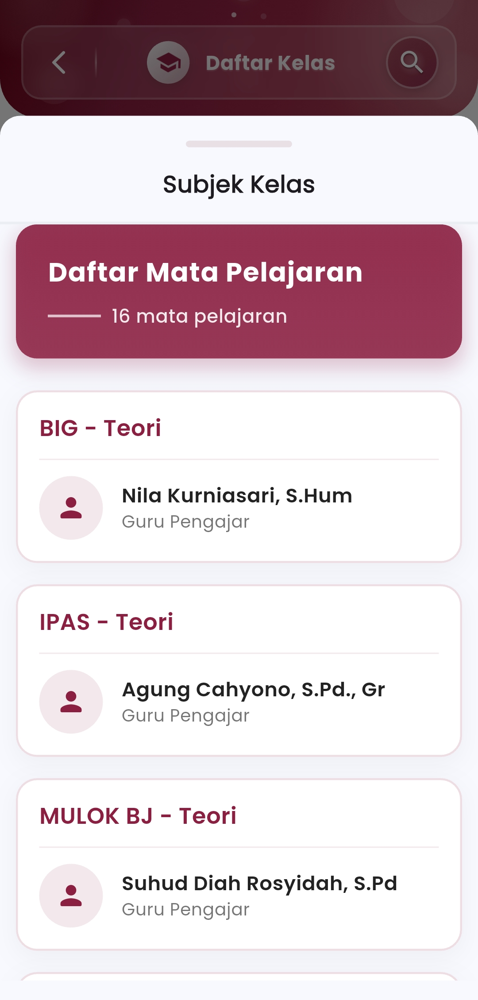

# Lihat kelas

### **Lihat Kelas**

#### Navigasi Lengkap Kelas dan Mata Pelajaran dalam Genggaman

Menu **Lihat Kelas** memberikan akses cepat dan terorganisir kepada seluruh informasi terkait kelas, guru wali, serta mata pelajaran yang diajarkan. Dirancang untuk guru, siswa, maupun admin sekolah — fitur ini memungkinkan Anda melihat struktur kelas secara menyeluruh, siapa yang mengajar, hingga subjek yang tersedia di masing-masing kelas.

<figure><figcaption></figcaption></figure> <figure><figcaption></figcaption></figure>

#### **Daftar Kelas & Wali Kelas**

Setiap kelas ditampilkan dalam format kartu dengan identitas lengkap:

* **Nama Kelas** & jurusan (contoh: XII RPL D)
* **Guru Wali Kelas** lengkap dengan nama dan gelar
* Tombol **“Selengkapnya”** untuk melihat rincian siswa, mata pelajaran, dan guru pengajar

Tampilan yang elegan memudahkan Anda menemukan kelas hanya dalam beberapa ketukan.

#### **Subjek dan Mata Pelajaran**

Fitur ini menampilkan seluruh **mata pelajaran** yang terhubung dengan masing-masing kelas, lengkap dengan:

* **Nama Mata Pelajaran** & jenis (Teori/Praktik)
* **Nama Guru Pengajar**
* **Ikon avatar** untuk memudahkan identifikasi visual

#### **Fitur Pencarian Kelas**

Dengan ikon **cari** di bagian atas layar, pengguna bisa dengan cepat menemukan kelas berdasarkan nama, jurusan, atau nama wali kelas. Ini sangat membantu untuk sekolah dengan jumlah kelas dan guru yang banyak.

***

Jika Anda membutuhkan bantuan lebih lanjut, hubungi kami melalui [halaman Bantuan eSchool](https://www.eschool.ac.id/#contact-us)
