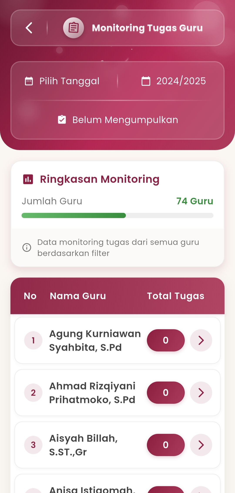

# Monitoring Tugas Guru

### **Monitoring Tugas Guru**

#### Pantau Tugas Guru Secara Real-Time, Akurat & Terorganisir

Fitur **Monitoring Tugas Guru** pada eSchool Mobile memudahkan admin sekolah dalam melacak dan memastikan seluruh guru telah menyelesaikan kewajiban pengumpulan tugas sesuai jadwal. Didesain dengan tampilan yang intuitif dan elegan, menu ini menghadirkan transparansi dan efisiensi dalam manajemen akademik.

<figure><figcaption></figcaption></figure>

#### &#x20;**Fitur Inti**

**Filter Berdasarkan Tanggal & Tahun Ajaran**

Pilih waktu spesifik untuk melakukan monitoring, sehingga data yang ditampilkan sesuai dengan periode yang diinginkan. Cocok untuk inspeksi harian, mingguan, hingga semesteran.

**Ringkasan Monitoring Otomatis**

Tampilan cepat jumlah guru yang dimonitor:

* **Total Guru Terdaftar**: Jumlah keseluruhan yang terintegrasi dalam sistem
* **Indikator Visual**: Progress bar warna hijau menunjukkan pencapaian pengumpulan tugas secara keseluruhan
* **Status ‘Belum Mengumpulkan’**: Identifikasi guru yang belum menyerahkan tugas

**Daftar Nama Guru & Jumlah Tugas**

Disajikan dalam bentuk tabel interaktif:

* Nama guru lengkap
* Total tugas yang telah dikumpulkan
* Tombol akses detail untuk melihat status tugas per guru

Tampilan ini membantu admin melakukan tindak lanjut cepat kepada guru yang belum menyelesaikan tugas pengajaran secara optimal.

#### Manfaat Monitoring Tugas Guru

* 📶 Memastikan tanggung jawab akademik terpenuhi tepat waktu
* 🔍 Menemukan kendala pengumpulan tugas sejak dini
* 📥 Mendorong konsistensi dan kedisiplinan guru
* 📚 Mendukung proses evaluasi kerja pendidik

Menu ini sangat cocok digunakan oleh bagian kurikulum, kepala sekolah, atau admin akademik untuk memastikan mutu kegiatan belajar mengajar berjalan sesuai perencanaan.&#x20;

***

Jika Anda membutuhkan bantuan lebih lanjut, hubungi kami melalui [halaman Bantuan eSchool](https://www.eschool.ac.id/#contact-us)
