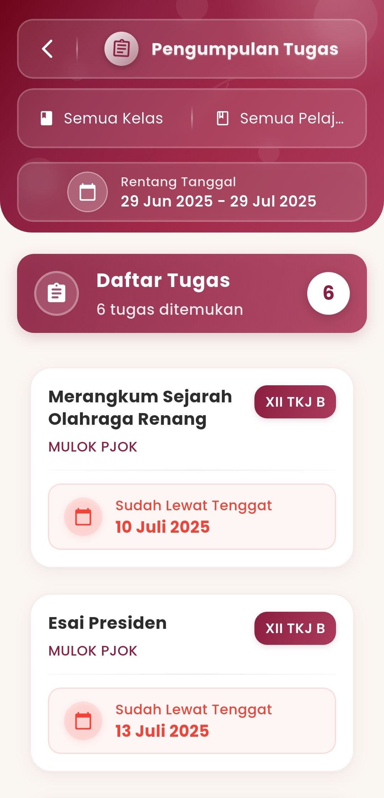
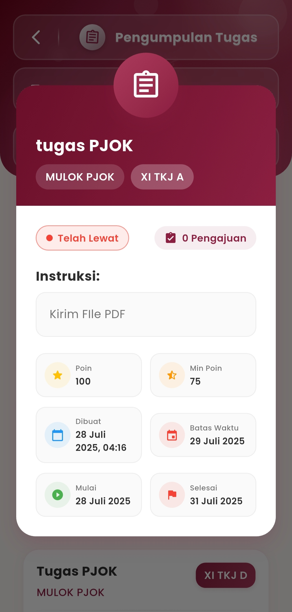

# Pengumpulan Tugas

### Pengumpulan Tugas

**Pantau seluruh tugas yang telah diunggah oleh guru ke dalam sistem.**\
Fitur ini dirancang khusus untuk admin sekolah dan tim pengelola kurikulum dalam memastikan distribusi tugas berjalan optimal di seluruh kelas dan mata pelajaran.

<figure><figcaption></figcaption></figure> <figure><figcaption></figcaption></figure>

#### Fungsi Utama:

* **Monitoring Tugas dari Semua Guru**\
  Lihat daftar tugas yang telah dibuat oleh guru, lengkap dengan rincian pelajaran, kelas tujuan, dan status tenggat waktu.
* **Filter Fleksibel**\
  Telusuri tugas berdasarkan:
  * Kelas (contoh: XII TKJ B, XI TKJ A)
  * Mata Pelajaran (contoh: PJOK, MULOK)
  * Rentang tanggal (awal hingga akhir bulan/tahun ajaran)
* **Indikator Tenggat Waktu Otomatis**\
  Tugas yang lewat batas waktu akan ditandai otomatis (contoh: 🔴 _Sudah Lewat Tenggat – 10 Juli 2025_) untuk memudahkan pengecekan.
* **Detail Tugas Terstruktur**\
  Klik pada tugas untuk melihat informasi:
  * Instruksi tugas (misalnya: _Kirim file PDF_)
  * Poin maksimal & minimal
  * Tanggal dibuat, dimulai, deadline, dan selesai
  * Jumlah siswa yang telah mengumpulkan

#### Manfaat untuk Admin & Tim Kurikulum:

* **Kontrol Proses Akademik**\
  Memastikan semua guru telah mengunggah tugas secara tepat waktu dan terjadwal.
* **Evaluasi Kedisiplinan**\
  Dapat digunakan untuk mengevaluasi keteraturan pengajaran berdasarkan intensitas dan ketepatan guru dalam memberi tugas.
* **Audit Akademik**\
  Memberikan bukti historis bahwa pembelajaran berjalan aktif dan terpantau.

#### Versi Singkat untuk Ditampilkan di Aplikasi:

> **Pantau tugas yang diunggah oleh guru.** Telusuri berdasarkan kelas, pelajaran, dan tanggal. Dapatkan data tenggat waktu, instruksi, serta status pengumpulan dari siswa.

***

Jika Anda membutuhkan bantuan lebih lanjut, hubungi kami melalui [halaman Bantuan eSchool](https://www.eschool.ac.id/#contact-us)
