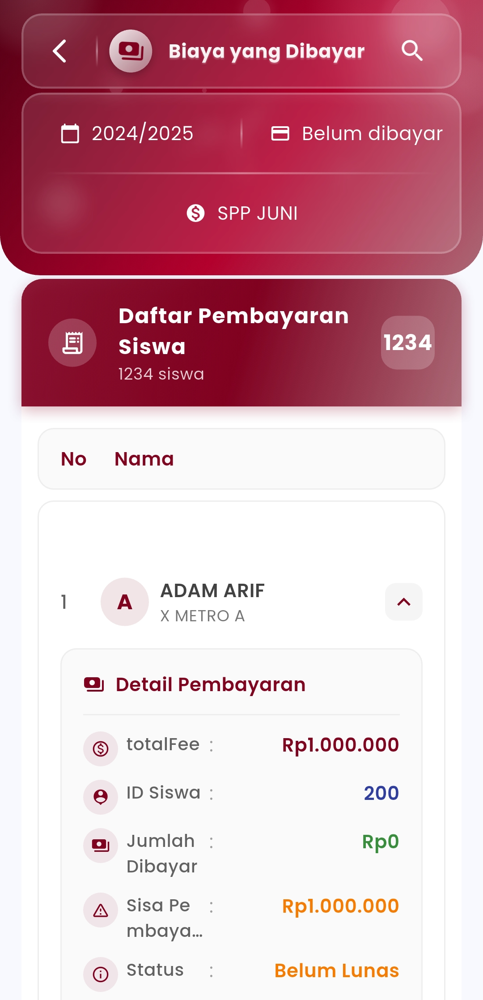
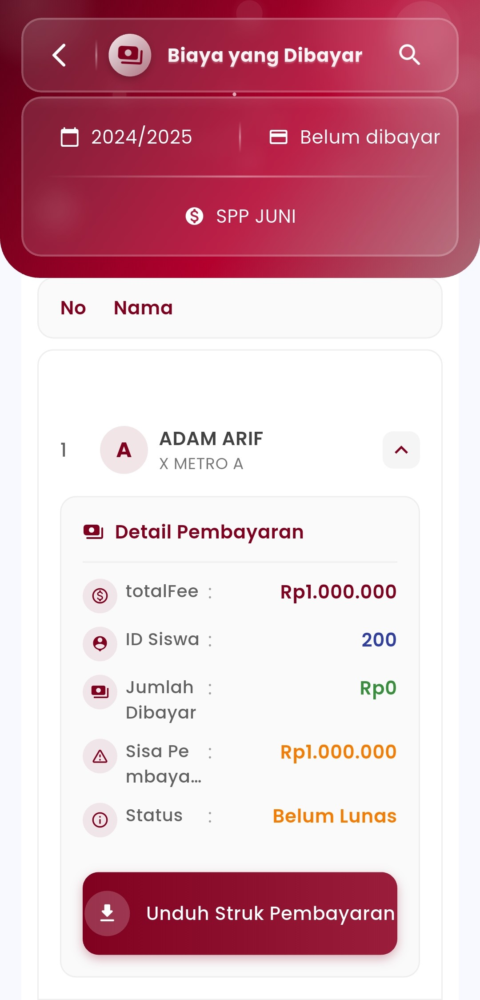

# Biaya yang Dibayar

### **Biaya yang Dibayar**

**Pantau dan Kelola Pembayaran Siswa dengan Mudah**

Lacak seluruh transaksi pembayaran siswa secara terstruktur dan efisien dalam satu tampilan. Fitur ini memudahkan Anda untuk mengetahui status pembayaran setiap siswa—baik yang sudah lunas maupun yang masih memiliki tunggakan.

<figure><figcaption></figcaption></figure> <figure><figcaption></figcaption></figure>

#### **Fitur Utama**

* **Filter Tahun & Status**\
  Telusuri data pembayaran berdasarkan tahun ajaran dan status pembayaran (sudah atau belum dibayar).
* **Daftar Pembayaran Lengkap**\
  Tampilkan seluruh siswa dengan informasi pembayaran seperti:
  * Total Biaya
  * Jumlah yang Sudah Dibayar
  * Sisa Pembayaran
  * Status (Lunas / Belum Lunas)
* **Detail Pembayaran yang Jelas**\
  Setiap siswa memiliki informasi pembayaran terperinci termasuk ID siswa, kelas, dan rincian lainnya.
* **Unduh Struk Pembayaran**\
  Tersedia tombol khusus untuk mengunduh struk pembayaran sebagai bukti transaksi digital.

#### 📌 **Contoh Penggunaan**

> “Dengan fitur ini, admin sekolah dapat langsung mengetahui siswa mana yang belum membayar SPP bulan tertentu, tanpa harus memeriksa secara manual satu per satu.”

***

Jika Anda membutuhkan bantuan lebih lanjut, hubungi kami melalui [halaman Bantuan eSchool](https://www.eschool.ac.id/#contact-us)
