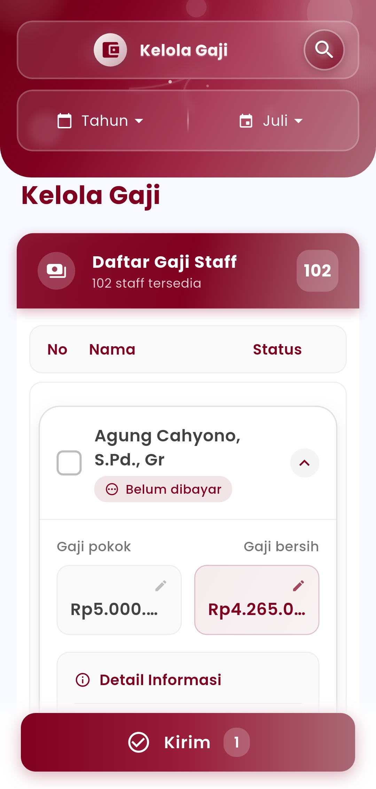
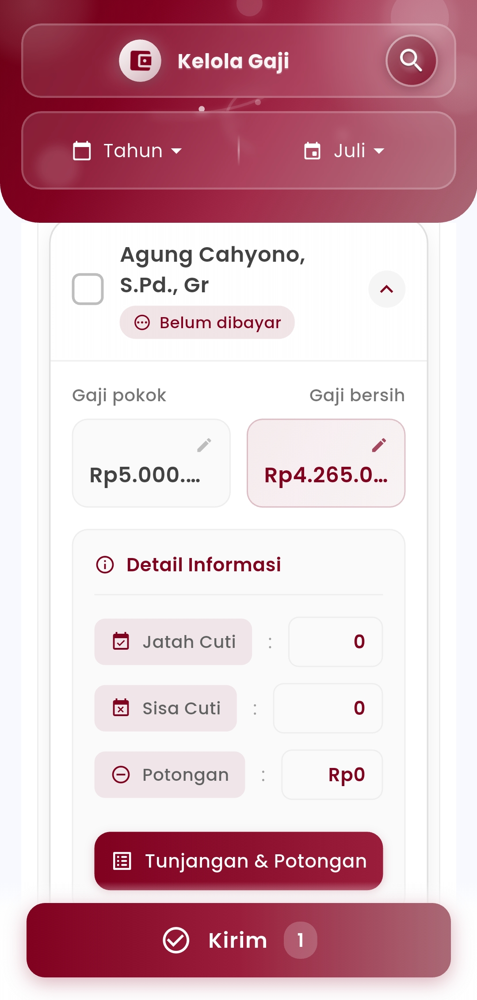

# Kelola Gaji

### **Kelola Gaji Guru**

**Kelola dan Pantau Penggajian Guru dengan Praktis dan Transparan**

Dengan fitur ini, pengguna dapat langsung melihat **status pembayaran** masing-masing guru (sudah dibayar atau belum dibayar), melakukan pengecekan **gaji pokok**, **gaji bersih**, hingga rincian **tunjangan, potongan**, serta **informasi cuti** seperti jatah dan sisa cuti aktif.

Selain itu, admin juga dapat melakukan **penyesuaian gaji** langsung dari tampilan, mulai dari mengedit jumlah, menambahkan atau mengurangi komponen tunjangan-potongan, hingga menyelesaikan proses pengiriman gaji secara massal maupun individu. Semua dilakukan hanya dalam beberapa langkah sederhana, namun tetap menjaga ketepatan dan transparansi.

<figure><figcaption></figcaption></figure> <figure><figcaption></figcaption></figure>

#### &#x20;**Fitur Utama**

* **Filter Berdasarkan Periode:** Pilih tahun dan bulan gaji yang akan dikelola.
* **Status Gaji Terpantau:** Lihat siapa saja guru yang belum atau sudah menerima gaji.
* **Rincian Gaji Lengkap:** Tampilkan gaji pokok, gaji bersih, tunjangan, potongan, dan histori cuti.
* **Edit Langsung:** Ubah nilai atau komponen gaji langsung dari tampilan tanpa harus pindah ke halaman lain.
* **Kirim Gaji Sekaligus:** Tandai dan kirimkan gaji ke banyak guru dalam satu waktu.
* **Transparansi Terjamin:** Setiap guru memiliki catatan gaji yang bisa dicek dan diakses oleh pihak berwenang.

#### **Manfaat untuk Pengguna**

* **Efisiensi waktu:** Semua data penting tersaji dengan jelas, mempermudah proses penggajian bulanan.
* **Akurasi tinggi:** Hindari kesalahan input manual dengan tampilan data yang real-time dan bisa disesuaikan.
* **Kontrol penuh:** Admin memiliki kontrol total atas setiap komponen pembayaran gaji.
* **Transparansi dan kepercayaan:** Memperkuat profesionalisme sekolah dalam urusan keuangan kepada para guru.

**Catatan:**\
Menu ini dikhususkan untuk pengelolaan gaji guru. Untuk manajemen staf non-guru, akan tersedia modul terpisah apabila dibutuhkan.

***

Jika Anda membutuhkan bantuan lebih lanjut, hubungi kami melalui [halaman Bantuan eSchool](https://www.eschool.ac.id/#contact-us)
