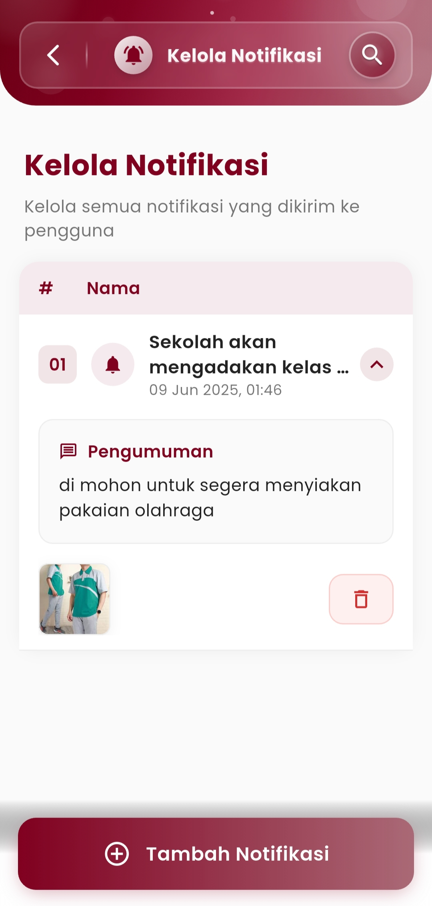
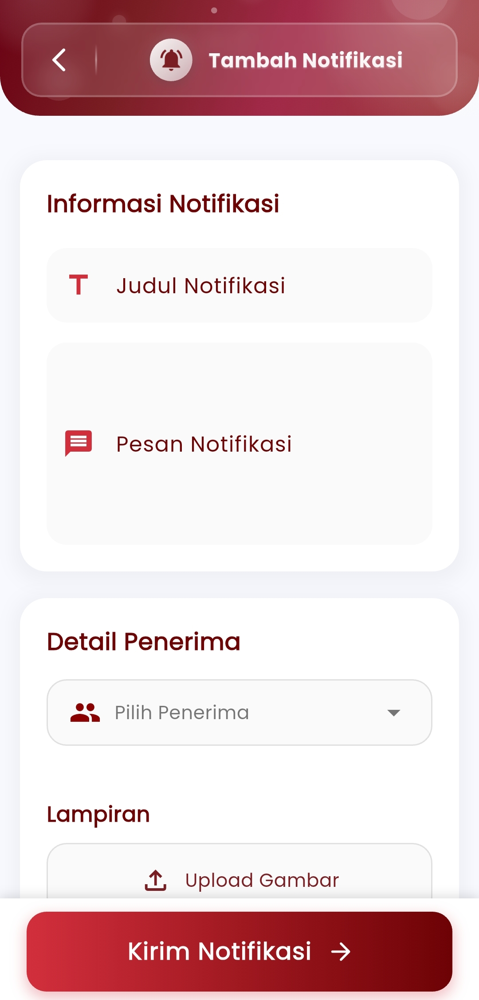
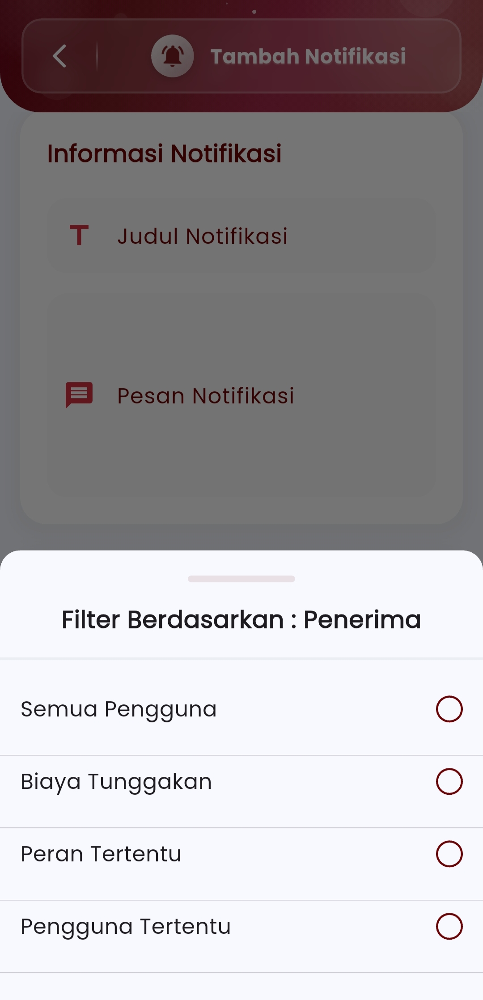

# Kelola Notifikasi

### Kelola Notifikasi

**Kelola semua pesan penting yang dikirimkan kepada pengguna aplikasi.**\
Pantau dan atur semua notifikasi—mulai dari pengumuman umum, informasi penting, hingga pemberitahuan khusus—dengan lebih mudah dan cepat.

<figure><figcaption></figcaption></figure> <figure><figcaption></figcaption></figure> <figure><figcaption></figcaption></figure>

#### Tambah Notifikasi

Buat dan kirimkan notifikasi secara langsung ke pengguna:

* **Judul Notifikasi:** Tentukan topik utama agar pengguna cepat memahami isi pesan.
* **Pesan Notifikasi:** Sampaikan informasi penting dengan jelas dan ringkas.
* **Detail Penerima:** Pilih target penerima berdasarkan:
  * Semua Pengguna
  * Pengguna dengan Tunggakan
  * Peran Tertentu (mis. siswa, guru, admin)
  * Pengguna Tertentu (individual)
* **Lampiran:** Tambahkan gambar pendukung jika diperlukan (contoh: brosur, poster kegiatan, dll).

#### Riwayat Notifikasi

**Lihat semua notifikasi yang sudah pernah dikirimkan.**\
Tersedia informasi lengkap:

* Waktu pengiriman
* Jenis pesan (pengumuman, pengingat, dll)
* Isi pesan
* Lampiran (jika ada)
* Opsi hapus untuk membersihkan daftar jika diperlukan

Dengan fitur ini, komunikasi sekolah menjadi lebih efisien, langsung ke sasaran, dan terdokumentasi rapi di satu tempat.

***

Jika Anda membutuhkan bantuan lebih lanjut, hubungi kami melalui [halaman Bantuan eSchool](https://www.eschool.ac.id/#contact-us)
