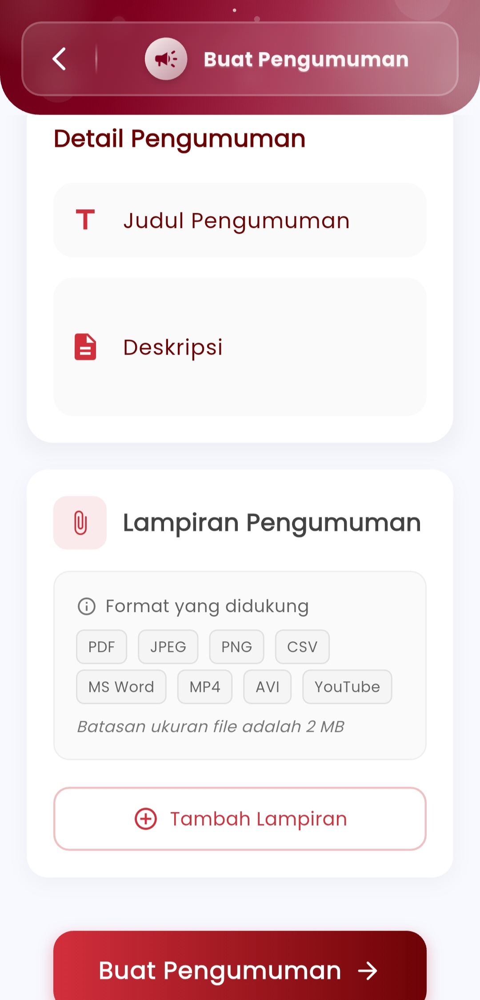

# Kelola Pengumuman

**Atur dan Publikasikan Informasi Penting dengan Mudah**

Fitur ini memungkinkan guru untuk membuat, mengedit, dan mengelola pengumuman kepada siswa atau kelas tertentu secara terorganisir dan efisien. Setiap pengumuman dapat disertai judul, deskripsi lengkap, serta lampiran pendukung dalam berbagai format file seperti PDF, Word, gambar, hingga tautan YouTube.

<figure><figcaption></figcaption></figure> <figure><figcaption></figcaption></figure>

&#x20;**Detail Pengumuman**

* **Judul Pengumuman**: Berikan nama singkat yang mencerminkan isi pengumuman.
* **Deskripsi**: Jelaskan isi pengumuman secara rinci agar siswa memahami maksud dan tindak lanjutnya.

&#x20;**Lampiran Pengumuman**

* Unggah file pendukung dalam berbagai format seperti PDF, JPEG, PNG, CSV, MP4, AVI, dan dokumen Word.
* Ukuran maksimal setiap file adalah 2 MB.
* Mendukung juga tautan video (YouTube) untuk pengumuman berbasis media.

&#x20;**Publikasi**

* Setelah pengumuman dibuat, tekan tombol **Buat Pengumuman** untuk mengirimkannya secara langsung ke kelas atau siswa tujuan.
* Pengumuman yang sudah dibuat dapat dikelola, diperbarui, atau dihapus sesuai kebutuhan.

***

Jika Anda membutuhkan bantuan lebih lanjut, hubungi kami melalui [halaman Bantuan eSchool](https://www.eschool.ac.id/#contact-us)
