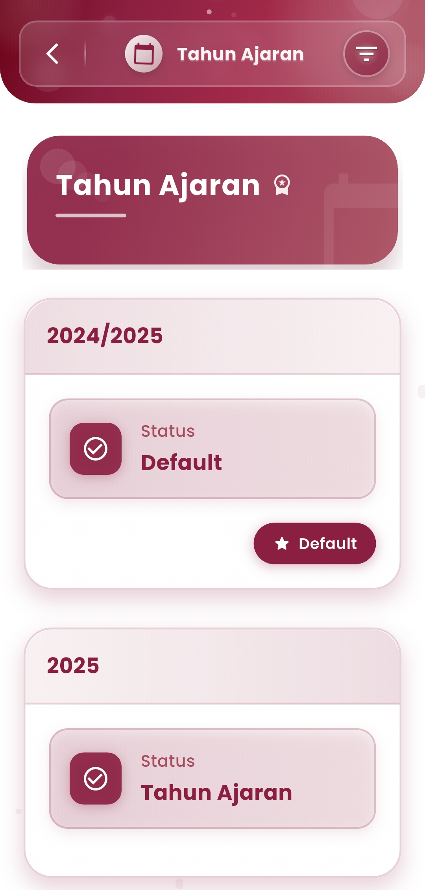

# Tahun ajaran

**Tahun Ajaran**

#### Atur & Kelola Tahun Akademik Sekolah dengan Lebih Rapi

Menu **Tahun Ajaran** pada aplikasi eSchool memudahkan admin sekolah dalam mengatur periode pendidikan yang sedang berlangsung, serta menyesuaikan status tahun ajaran aktif dan default yang digunakan oleh seluruh modul sistem sekolah.

<figure><figcaption></figcaption></figure>

#### Fitur Utama:

**Status Tahun Ajaran**

Lihat status terkini dari setiap tahun ajaran yang tersedia:

* **Default**: Tahun ajaran utama yang digunakan secara sistem oleh seluruh modul.
* **Aktif/Terdaftar**: Tahun ajaran baru yang telah dibuat dan siap diaktifkan jika diperlukan.

#### Akses Khusus

Menu ini hanya tersedia bagi **admin sekolah** atau pihak yang memiliki hak kelola sistem, sehingga keamanan dan keakuratan pengaturan tetap terjaga.

***

Jika Anda membutuhkan bantuan lebih lanjut, hubungi kami melalui [halaman Bantuan eSchool](https://www.eschool.ac.id/#contact-us)
