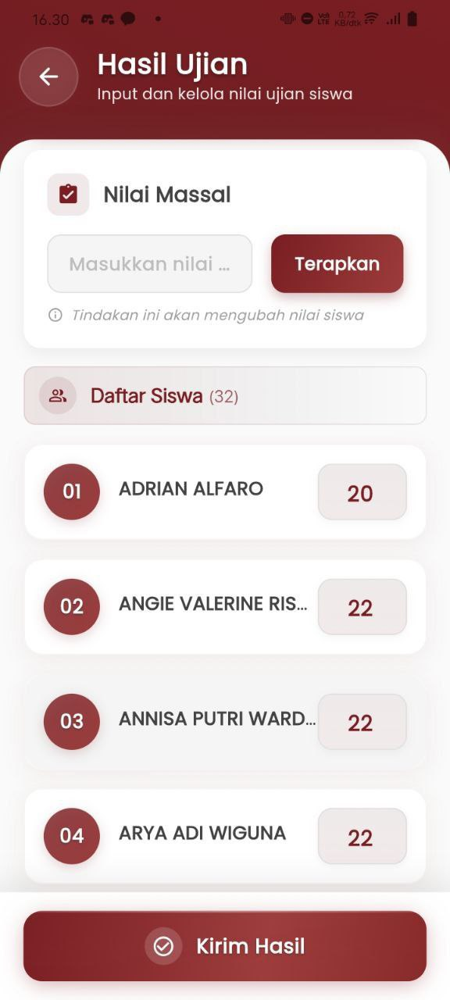

# Hasil Ujian Offline

#### Input, Atur, dan Laporkan Nilai Ujian dengan Cepat dan Akurat

Menu **Hasil Ujian Offline** memfasilitasi guru dalam melakukan penilaian secara efisien untuk setiap peserta didik yang mengikuti ujian secara tatap muka. Dengan antarmuka yang bersih dan sistematis, proses pengisian, perubahan, hingga pengiriman nilai dilakukan dalam satu layar tanpa hambatan.

<figure><figcaption></figcaption></figure>

#### **Fitur-Fitur Utama**

**Nilai Massal**

Masukkan skor seragam untuk seluruh siswa dengan sekali klik. Cukup ketik nilai pada kolom yang tersedia dan tekan **"Terapkan"**, sistem secara otomatis akan mengisi kolom nilai semua siswa secara bersamaan — sangat bermanfaat untuk ujian yang memiliki bobot penilaian standar.

**Daftar Siswa Interaktif**

Tampilkan nama dan urutan siswa secara otomatis:

* Total jumlah siswa (contoh: **32 siswa**)
* Penomoran otomatis dan alfabetis
* Kolom nilai individual yang dapat diubah kapan saja sesuai kebutuhan

Tampilan ini memudahkan pendidik dalam memantau dan mengoreksi input nilai siswa satu per satu.

**Kirim Hasil Nilai**

Setelah proses penilaian selesai, guru dapat langsung menekan tombol **“Kirim Hasil”** untuk:

* Menyimpan dan mengarsipkan nilai
* Mengirim nilai ke sistem pusat atau wali kelas
* Memastikan seluruh data nilai sudah terkirim dengan benar

Tindakan ini menandai bahwa proses penilaian telah diselesaikan dengan validasi akhir.

***

Jika Anda membutuhkan bantuan lebih lanjut, hubungi kami melalui [halaman Bantuan eSchool](https://www.eschool.ac.id/#contact-us).
