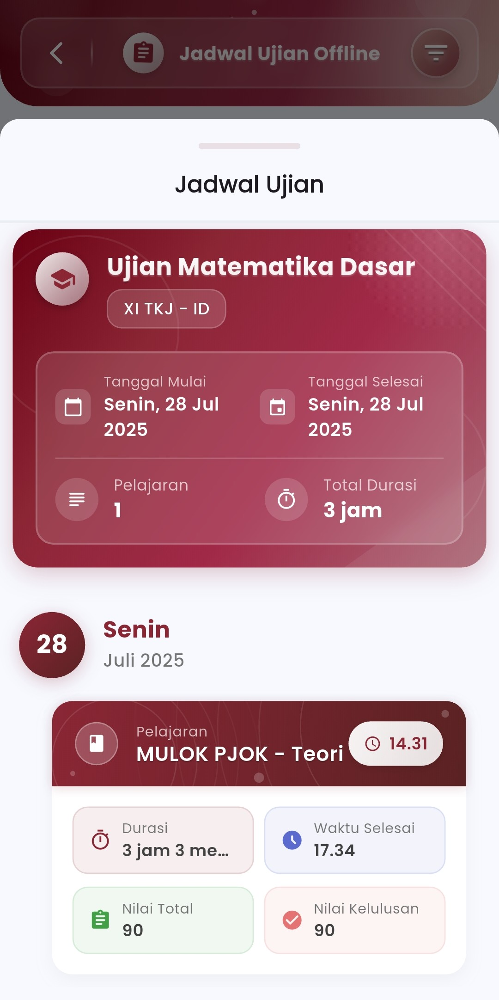
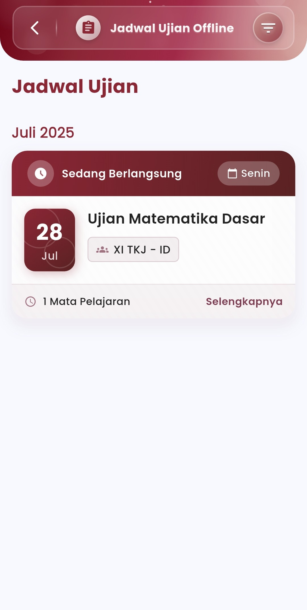

# Jadwal Ujian Offline

#### Atur dan Pantau Seluruh Kegiatan Ujian Tatap Muka secara Efisien

Menu **Jadwal Ujian Offline** dirancang untuk memberikan visibilitas menyeluruh kepada guru dan siswa mengenai pelaksanaan ujian secara luring (offline). Dengan tampilan antarmuka yang bersih dan informatif, pengguna dapat memantau jadwal harian, rincian pelajaran yang diuji, dan status ujian secara real-time.

<figure><figcaption></figcaption></figure> <figure><figcaption></figcaption></figure>

#### **Fitur-Fitur Utama**

&#x20;**Status Ujian Real-Time**

Setiap ujian yang sedang berlangsung akan ditandai dengan label **"Sedang Berlangsung"**, sehingga memudahkan pengguna dalam mengidentifikasi kegiatan yang aktif pada hari tersebut.

**Rincian Tanggal dan Hari**

Sistem menampilkan informasi jadwal secara detail:

* Hari dan tanggal pelaksanaan
* Tanggal mulai dan selesai ujian
* Total durasi pelaksanaan ujian

Semua disusun secara kronologis agar mudah ditelusuri, terutama dalam pelaksanaan ujian yang padat.

**Kelas dan Mapel Terintegrasi**

* Tampilkan **kelas peserta ujian** (contoh: XI TKJ - ID)
* Jumlah dan jenis **mata pelajaran** yang diujikan
* Informasi tambahan seperti waktu mulai, waktu selesai, serta **nilai minimal kelulusan**

**Nilai & Evaluasi**

Setiap ujian juga disertai dengan:

* **Nilai Total Maksimal** — untuk menilai hasil ujian siswa
* **Nilai Kelulusan** — sebagai standar kompetensi yang harus dicapai

Nilai ini ditampilkan secara langsung dalam kartu ujian untuk memudahkan pemantauan hasil.

**Navigasi Rinci**

Tombol **“Selengkapnya”** memungkinkan pengguna melihat:

* Rincian pelajaran yang diujikan
* Waktu pelaksanaan per mapel
* Durasi spesifik dan metrik evaluasi yang digunakan

Jadwal Harian yang Terstruktur

Dalam satu tampilan, pengguna dapat melihat:

* Ujian yang sedang dan akan berlangsung
* Pembagian jadwal per hari dan per mata pelajaran
* Warna dan ikon yang membedakan status ujian dan informasi penting

***

Jika Anda membutuhkan bantuan lebih lanjut, hubungi kami melalui [halaman Bantuan eSchool](https://www.eschool.ac.id/#contact-us).
