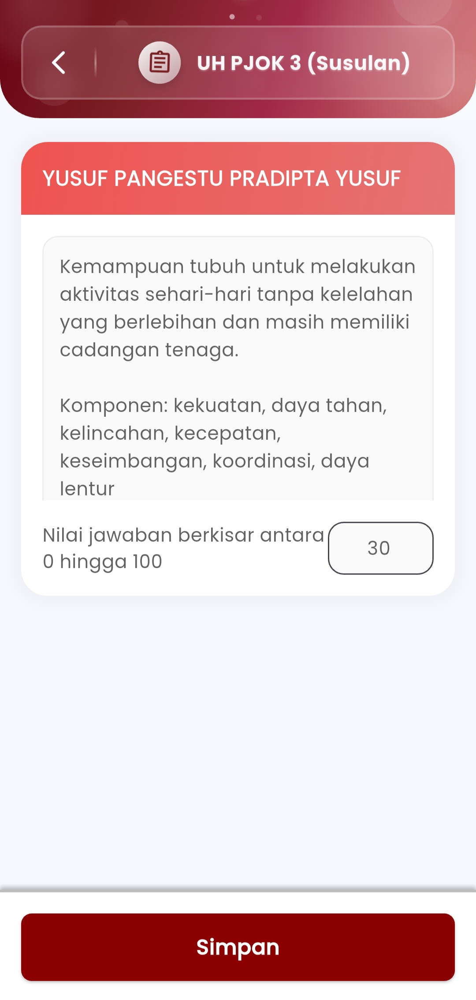
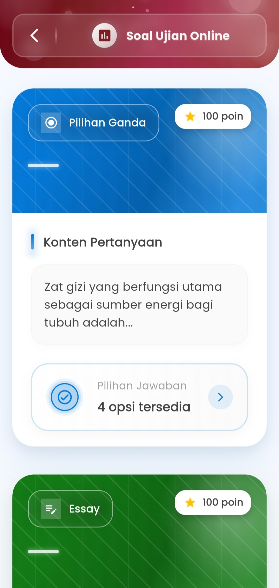
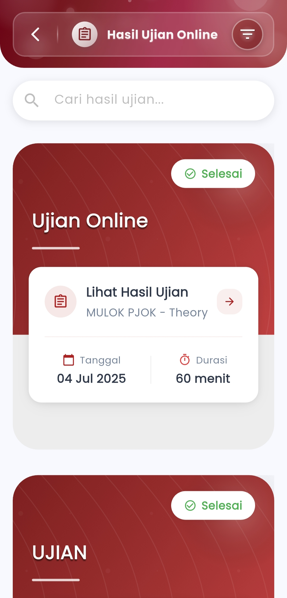

# Hasil Ujian Online

### **Hasil Ujian Online**

#### Pantau Nilai Ujian Siswa Secara Langsung, Praktis, dan Transparan

Menu **Hasil Ujian Online** dirancang untuk membantu guru memantau, mengoreksi, dan merekap seluruh hasil ujian berbasis daring dengan efisien. Semua data tersaji secara real-time dalam tampilan visual yang bersih, modern, dan intuitif — dari nama ujian hingga total durasi pengerjaan.

<figure><figcaption></figcaption></figure> <figure><figcaption></figcaption></figure> <figure><figcaption></figcaption></figure>

#### **Fitur-Fitur Utama**

**Ringkasan Ujian Terstruktur**

Setiap ujian ditampilkan dalam format kartu yang berisi:

* Judul ujian dan mata pelajaran
* Tanggal pelaksanaan dan durasi
* Indikator status (✅ Selesai / ⏳ Berlangsung)

Memudahkan pengguna dalam memilih dan mengecek hasil ujian berdasarkan waktu dan jenisnya.

**Lihat Detail Hasil**

Tekan tombol **“Lihat Hasil Ujian”** untuk mengakses:

* Rekap nilai tiap siswa
* Performa soal (untuk pilihan ganda dan esai)
* Tampilan respons jawaban siswa yang mudah dibaca

Semua komponen ini mendukung evaluasi mendalam terhadap pencapaian siswa dalam satu tempat.

**Penilaian Esai Manual**

Untuk soal esai:

* Guru dapat melihat jawaban lengkap siswa
* Input skor secara manual (0–100) per soal
* Penilaian langsung dari layar yang sama

Sangat berguna untuk memberikan penilaian berbasis rubrik atau observasi langsung.

**Validasi & Penyimpanan Otomatis**

Setelah seluruh nilai diperiksa:

* Sistem secara otomatis menyimpan hasil
* Nilai terarsipkan dan siap dikirim ke dashboard pusat atau wali kelas

Menjamin tidak ada data yang terlewat atau hilang.

***

Jika Anda membutuhkan bantuan lebih lanjut, hubungi kami melalui [halaman Bantuan eSchool](https://www.eschool.ac.id/#contact-us).
