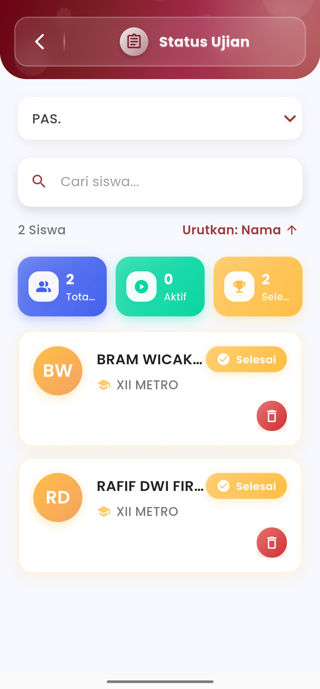

# Status Siswa Ujian&#x20;

### **Status Ujian Siswa**

#### Pantau Progres Ujian Siswa Secara Langsung dan Terperinci

Menu **Status Ujian Siswa** memungkinkan guru dan pengawas memonitor pelaksanaan ujian siswa secara real-time dengan visual yang informatif dan mudah dipahami. Dari total peserta, aktivitas saat ini, hingga penyelesaian, semua tersaji dalam satu layar terpadu.

<figure><figcaption></figcaption></figure>

#### **Fitur-Fitur Utama**

**Ringkasan Statistik Otomatis**

Tepat di bagian atas, tersedia indikator jumlah siswa dalam beberapa kategori:

* **Total** siswa yang terdaftar mengikuti ujian
* **Aktif**: siswa yang sedang mengerjakan ujian secara real-time
* **Selesai**: siswa yang telah menyelesaikan ujian sepenuhnya

Statistik ini mempercepat proses pemantauan tanpa harus membuka detail setiap siswa.

**Daftar Siswa Lengkap & Interaktif**

Tiap siswa ditampilkan dalam kartu khusus berisi:

* **Inisial & Nama Lengkap** siswa
* **Kelas** siswa
* Status individual: ✅ **Selesai** atau ⏳ **Belum**
* Ikon **hapus** untuk membatalkan atau mengeluarkan siswa dari ujian jika dibutuhkan

Daftar dapat disortir berdasarkan **Nama**, memberikan fleksibilitas dalam pengelolaan data siswa.

**Pencarian Nama Siswa**

Gunakan fitur pencarian untuk menemukan siswa tertentu dengan cepat berdasarkan nama. Sangat praktis saat jumlah peserta ujian banyak dan Anda ingin mengakses data spesifik tanpa scroll panjang.

#### Desain yang Adaptif & Efisien

Dengan warna-warna status yang kontras dan ikon intuitif, menu ini dibuat agar guru dapat memahami dan menindaklanjuti kondisi ujian dalam hitungan detik. Setiap elemen dirancang untuk memudahkan pengambilan keputusan saat ujian berlangsung.

***

Jika Anda membutuhkan bantuan lebih lanjut, hubungi kami melalui [halaman Bantuan eSchool](https://www.eschool.ac.id/#contact-us).
