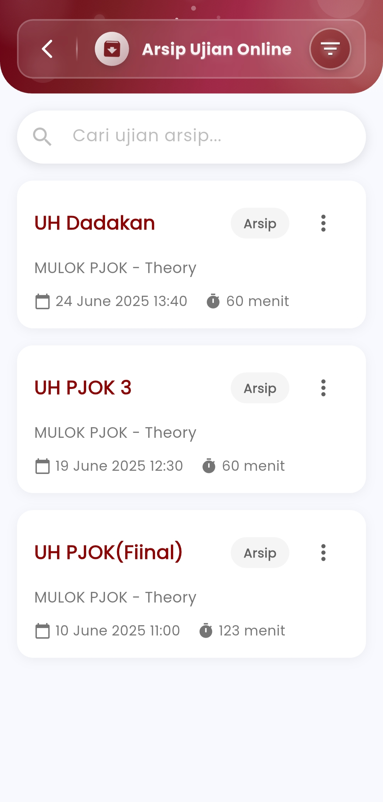
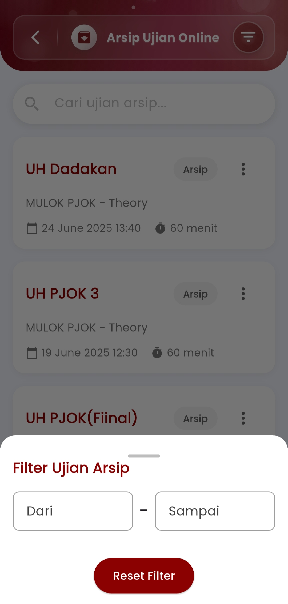

# Archive ujian online

### **Arsip Ujian Online**

#### Kelola dan Lacak Seluruh Riwayat Ujian Digital Anda dengan Mudah

Menu **Arsip Ujian Online** dirancang untuk memberikan akses cepat dan terorganisir terhadap semua ujian yang telah diselesaikan atau tidak lagi aktif. Guru dapat menyimpan, mencari, dan memulihkan data ujian yang telah diarsipkan, serta menjaga keteraturan pengelolaan ujian dalam jangka panjang.

<figure><figcaption></figcaption></figure> <figure><figcaption></figcaption></figure>

#### **Fitur-Fitur Utama**

**Pencarian Ujian Arsip**

Cari ujian tertentu dari daftar arsip dengan mudah menggunakan kata kunci nama ujian, mata pelajaran, atau tanggal. Fitur ini sangat berguna untuk melacak ujian-ujian lama yang ingin diakses kembali.

**Filter Tanggal Arsip**

Atur rentang tanggal untuk menampilkan hanya ujian yang masuk dalam periode waktu tertentu. Ini membantu mempercepat pencarian saat menangani data ujian dalam jumlah besar.

#### **Kelola Arsip Secara Fleksibel**

Untuk setiap ujian yang diarsipkan, pengguna dapat:

* **Pulihkan Ujian** — Mengaktifkan kembali ujian yang sudah diarsipkan untuk diedit atau digunakan ulang.
* **Hapus Permanen** — Menghapus ujian secara menyeluruh dari sistem jika tidak lagi dibutuhkan.

#### Informasi Ujian Tersimpan

Setiap ujian yang tampil dalam arsip mencakup:

* **Judul Ujian**
* **Mata Pelajaran & Kategori**
* **Tanggal & Jam Pelaksanaan**
* **Durasi Ujian (dalam menit)**
* **Label Status: Arsip**

Dengan tampilan yang rapi dan informatif, guru dapat meninjau semua detail penting tanpa harus membuka setiap item secara manual.

#### Manfaat Arsip

Menyimpan ujian ke dalam arsip bukan hanya membantu efisiensi, tapi juga menjaga integritas data dan kesiapan jika sewaktu-waktu perlu digunakan kembali untuk referensi, evaluasi, atau penyesuaian materi.

***

Jika Anda membutuhkan bantuan lebih lanjut, hubungi kami melalui [halaman Bantuan eSchool](https://www.eschool.ac.id/#contact-us).
