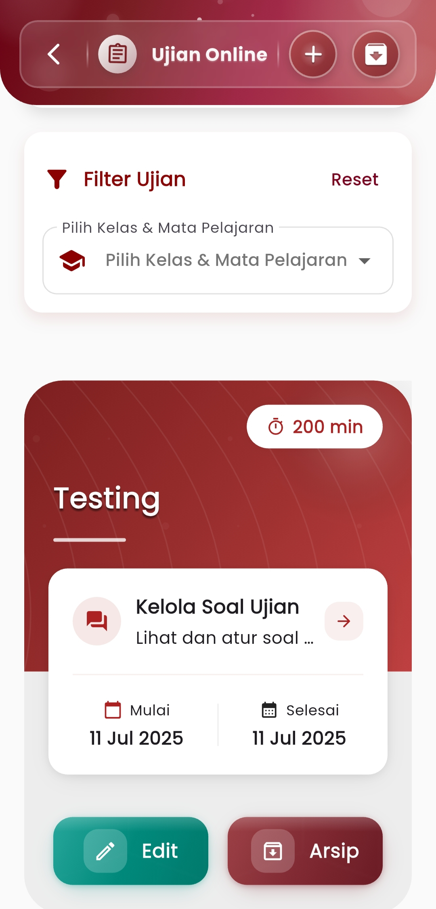
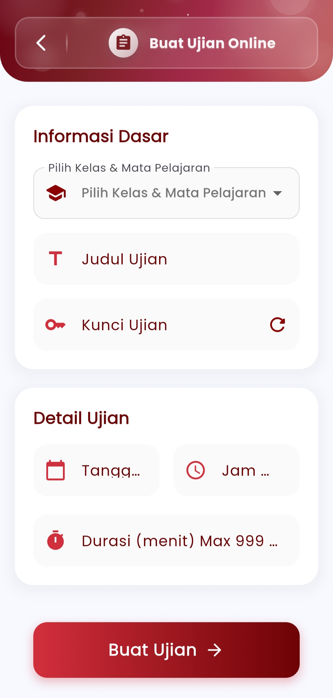

# Buat ujian online

**Ujian Online**

#### Kelola dan Laksanakan Ujian Digital dengan Praktis dan Terstruktur

Menu **Ujian Online** adalah pusat kendali untuk pembuatan, pengelolaan, serta pelaksanaan ujian berbasis digital. Fitur ini memberikan fleksibilitas tinggi bagi pendidik dalam menyusun soal, mengatur waktu pelaksanaan, hingga memantau pelaksanaan ujian siswa secara real-time.

<figure><figcaption></figcaption></figure> <figure><figcaption></figcaption></figure>

#### **Filter Ujian**

Gunakan filter dinamis untuk menyaring daftar ujian berdasarkan:

* **Kelas**
* **Mata pelajaran**

Fitur ini memudahkan pencarian ujian yang relevan, terutama ketika menangani banyak kelas atau topik ujian sekaligus.

#### **List Ujian yang Telah Dibuat**

Setiap entri ujian menampilkan informasi penting secara ringkas, termasuk:

* **Judul Ujian**
* **Waktu mulai dan selesai**
* **Durasi ujian (dalam menit)**
* Akses cepat ke **pengaturan soal** dan fitur **arsip/edit**

Dengan desain visual yang rapi, guru dapat memantau status ujian dan melakukan perubahan dengan cepat hanya dalam beberapa ketukan.

### **Buat Ujian Online**

#### Bangun Ujian Digital Anda dalam Beberapa Langkah Mudah

Fitur **Buat Ujian Online** memberikan kebebasan dalam menentukan parameter ujian secara detail dengan tampilan form yang efisien dan jelas.

#### Informasi Dasar

Tentukan:

* **Kelas dan mata pelajaran**
* **Judul ujian**
* **Kunci ujian (untuk akses masuk peserta)**

Kunci ujian dapat dihasilkan secara otomatis atau disesuaikan manual untuk menjaga kerahasiaan.

#### Detail Ujian

Atur:

* **Tanggal dan jam mulai**
* **Tanggal dan jam selesai**
* **Durasi ujian maksimal (hingga 999 menit)**

Ini memberikan kontrol penuh atas waktu pengerjaan dan validitas ujian.

#### Finalisasi

Setelah semua parameter ditetapkan, cukup tekan **"Buat Ujian"** untuk mempublikasikan ujian secara instan ke siswa pada kelas terkait. Ujian akan otomatis masuk ke dalam daftar dan dapat diedit kapan pun.

***

Jika Anda membutuhkan bantuan lebih lanjut, hubungi kami melalui [halaman Bantuan eSchool](https://www.eschool.ac.id/#contact-us).
