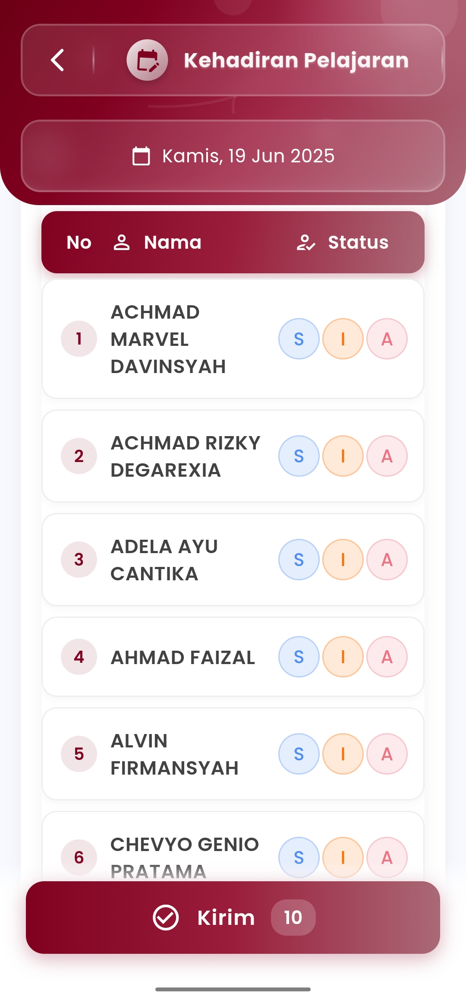
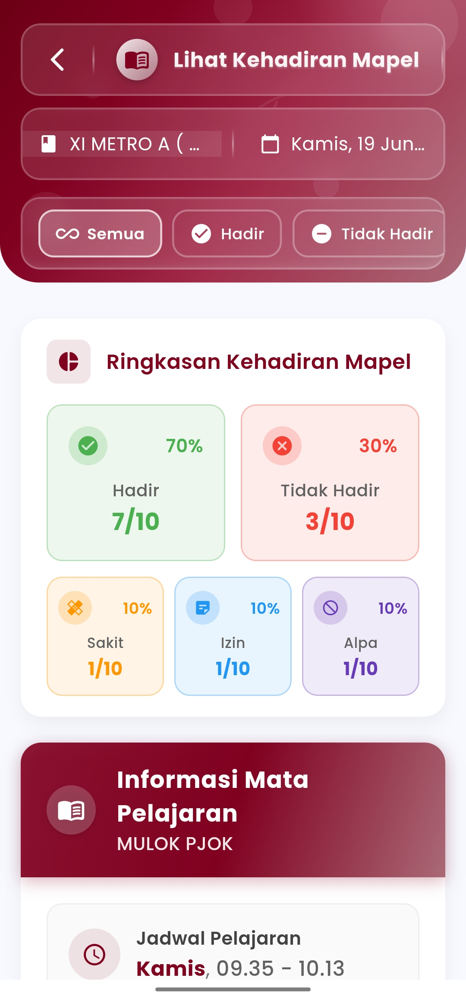

# Laporan Kehadiran Per Mapel

**Rekap Kehadiran Siswa per Mata Pelajaran Secara Real-Time**

Fitur **Laporan Kehadiran Pelajaran** di eSchool Mobile membantu guru memantau kehadiran siswa secara spesifik pada setiap sesi pelajaran, bukan hanya berdasarkan hari secara umum. Sistem ini dirancang untuk mendukung pencatatan yang lebih detail dan presisi di tingkat pengajaran per mapel.

<figure><figcaption></figcaption></figure> <figure><figcaption></figcaption></figure>

#### Fitur Utama:

* **Filter Berdasarkan Kelas, Tanggal, dan Mapel**\
  Guru dapat memilih kelas, tanggal, dan sesi mata pelajaran yang ingin direkap, misalnya: _MULOK PJOK – Kamis, 09.35–10.13 WIB_.
* **Ringkasan Kehadiran per Mapel**\
  Statistik kehadiran siswa ditampilkan dalam format visual:
  * &#x20;**Hadir** (jumlah dan persentase)
  * &#x20;**Sakit**
  * &#x20;**Izin**
  * &#x20;**Alpa**
* **Distribusi Persentase & Jumlah**\
  Setiap kategori disajikan lengkap dengan total siswa yang termasuk dalam status tersebut dan proporsi dalam bentuk persen.
* **Daftar Nama Siswa & Status Individu**\
  Tabel kehadiran siswa menampilkan nama-nama siswa beserta status kehadiran yang telah dicatat saat pelajaran berlangsung.
* **Tombol “Kirim”**\
  Untuk mengunggah atau menyimpan hasil catatan kehadiran ke sistem secara terpusat.

#### Manfaat:

* Memberikan gambaran **khusus untuk kehadiran per sesi pelajaran**
* Cocok untuk guru mata pelajaran yang mengajar lintas kelas
* Mendukung pelacakan keterlambatan, absensi selektif, dan pembinaan akademik
* Dapat dijadikan dasar rekap nilai partisipasi atau penilaian sikap

#### Tips Penggunaan:

* Lakukan pencatatan segera setelah sesi dimulai untuk keakuratan data
* Gunakan menu ini sebagai pelengkap dari laporan kehadiran harian/wali kelas
* Informasi ini otomatis terhubung ke rekap guru dan laporan akademik

***

Jika Anda membutuhkan bantuan lebih lanjut, hubungi kami melalui [halaman Bantuan eSchool](https://www.eschool.ac.id/#contact-us).
