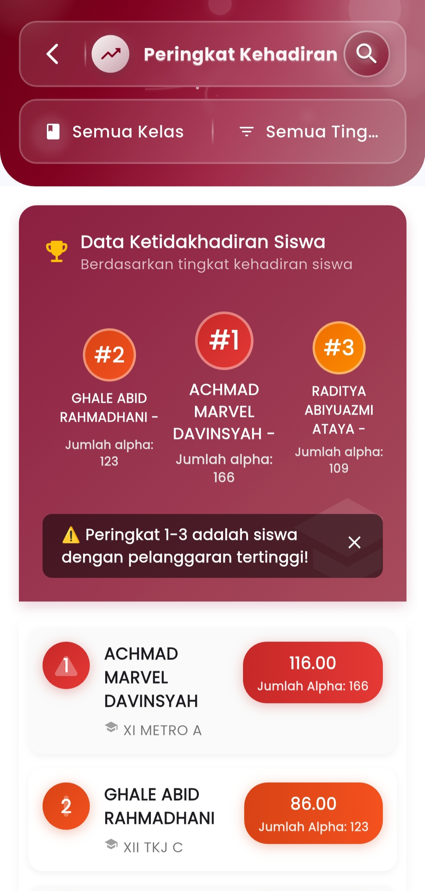
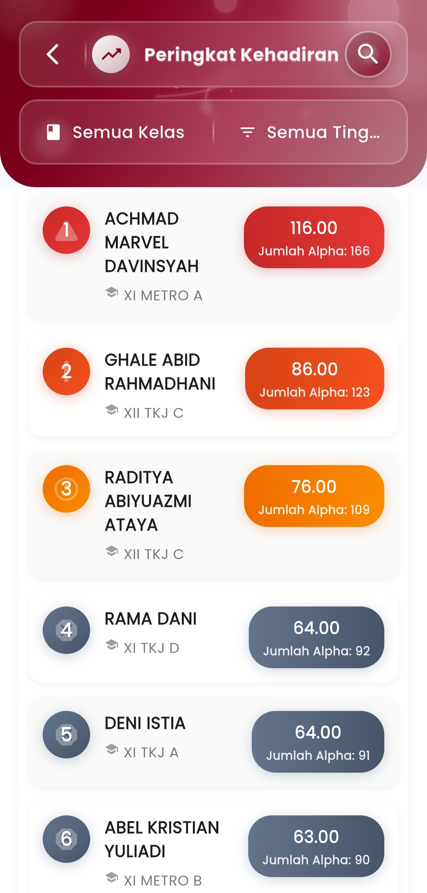

# Point Alpha Siswa Tertinggi

**Pantauan Khusus untuk Siswa dengan Tingkat Ketidakhadiran Tertinggi**

Menu **Poin Alpha Tertinggi** merupakan fitur pemantauan khusus dalam aplikasi eSchool Mobile yang menampilkan **peringkat siswa berdasarkan akumulasi ketidakhadiran (alpa)** tertinggi selama periode tertentu. Fitur ini mendukung evaluasi disiplin dan pembinaan siswa secara cepat dan terfokus.

<figure><figcaption></figcaption></figure> <figure><figcaption></figcaption></figure>

#### Fitur Utama:

* **Peringkat Berdasarkan Jumlah Alpha**\
  Sistem secara otomatis mengurutkan siswa berdasarkan jumlah kehadiran yang tidak sah (tanpa keterangan). Nilai alpa ditampilkan dalam format numerik dan visual.
*   **Highlight Siswa Terbawah (Pelanggaran Tertinggi)**\
    Peringkat 1–3 diberi penanda khusus karena masuk kategori pelanggaran kehadiran tertinggi.

    > Contoh:\
    > &#x20;Achmad Marvel Davinsyah — **166 alpa**\
    > &#x20;Ghale Abid Rahmadhani — **123 alpa**\
    > &#x20;Raditya Abiyuazmi Ataya — **109 alpa**
* **Filter Berdasarkan Kelas & Tingkat**\
  Pengguna dapat menyaring data berdasarkan kelas atau jenjang untuk meninjau secara lebih spesifik (misalnya: hanya kelas XII atau TKJ saja).
* **Tampilan Visual Berurutan**\
  Tiap siswa ditampilkan lengkap dengan:
  * Nama dan kelas
  * Jumlah poin alpa
  * Posisi ranking
  * Warna gradasi sesuai tingkat pelanggaran

#### Manfaat:

* Membantu guru BK, wali kelas, dan manajemen sekolah dalam:
  * Mengidentifikasi siswa yang perlu pembinaan khusus
  * Melakukan tindakan preventif sebelum nilai dan disiplin semakin menurun
  * Menyiapkan data laporan pelanggaran untuk rapat, komite, atau surat pemanggilan
* Mendorong keterbukaan dan kesadaran terhadap **tingkat kehadiran siswa secara objektif**

#### Catatan:

* Poin alpa adalah jumlah ketidakhadiran **tanpa keterangan resmi**.
* Fitur ini **tidak bertujuan untuk mempermalukan**, melainkan sebagai alat bantu intervensi yang lebih cepat dan terarah.
* **Peringkat 1–3** ditandai sebagai indikator siswa dengan ketidakhadiran **paling kritis**

***

Jika Anda membutuhkan bantuan lebih lanjut, hubungi kami melalui [halaman Bantuan eSchool](https://www.eschool.ac.id/#contact-us).
