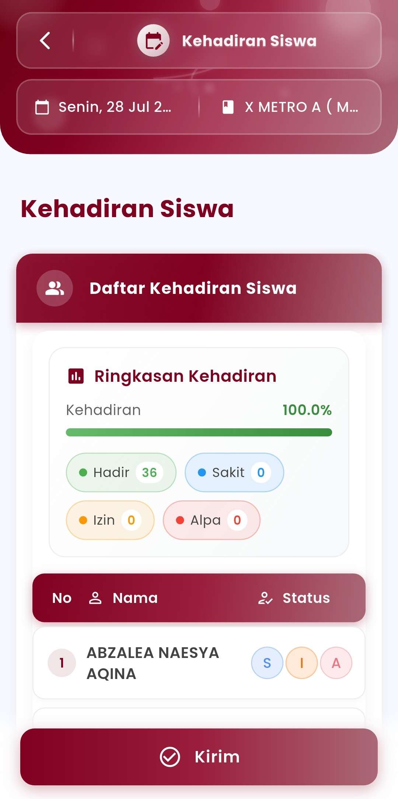

# Kehadiran Kegiatan Khusus

### Menu Kehadiran Siswa

**Catat, Pantau, dan Laporkan Kehadiran Secara Real-Time**

<figure><figcaption></figcaption></figure> <figure><figcaption></figcaption></figure>

Fitur **Kehadiran Siswa** di eSchool Mobile memungkinkan guru dan wali kelas untuk mencatat kehadiran harian peserta didik secara digital, cepat, dan akurat. Sistem ini dirancang agar efisien digunakan dalam kegiatan belajar maupun kegiatan sekolah lainnya langsung dari perangkat mobile.

#### Fitur Utama:

* **Filter Berdasarkan Tanggal & Kelas**\
  Guru dapat memilih tanggal dan kelas yang diampu sebelum melakukan pencatatan kehadiran.
* **Ringkasan Kehadiran Otomatis**\
  Tersedia visualisasi statistik kehadiran dalam bentuk progress bar dan jumlah masing-masing status:
  * &#x20;Hadir
  * &#x20;Sakit
  * &#x20;Izin
  * &#x20;Alpa
* **Input Kehadiran Individual**\
  Setiap siswa ditampilkan dalam daftar dengan pilihan status kehadiran yang bisa dipilih langsung (S/I/A) hanya dengan satu ketukan.
* **Tombol “Kirim”**\
  Data yang telah dicatat dapat langsung disimpan dan dikirim ke sistem pusat untuk pelaporan dan rekap otomatis.

#### Tujuan dan Manfaat:

* Mempermudah pencatatan kehadiran secara digital tanpa kertas
* Meningkatkan kecepatan pelaporan kehadiran harian
* Memastikan transparansi dan akurasi data yang terkoneksi dengan admin sekolah dan orang tua

#### Tips Penggunaan:

* Lakukan pencatatan tepat setelah siswa hadir di kelas atau kegiatan dimulai
* Gunakan fitur ringkasan untuk mengevaluasi kehadiran harian secara cepat

***

Jika Anda membutuhkan bantuan lebih lanjut, hubungi kami melalui [halaman Bantuan eSchool](https://www.eschool.ac.id/#contact-us).
