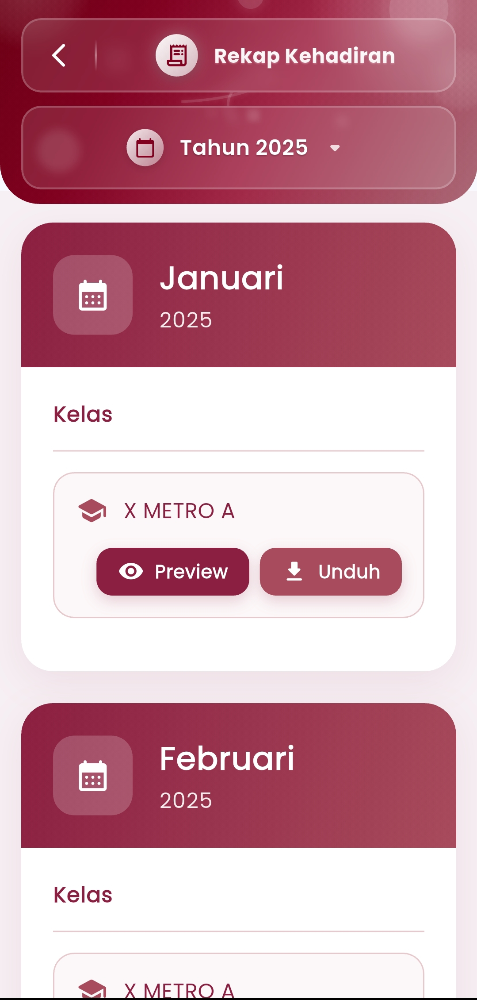
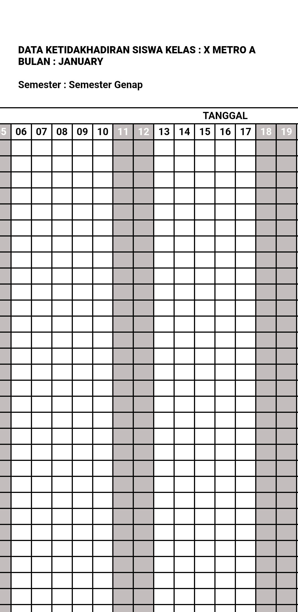

# Rekap Kehadiran

**Unduh dan Tinjau Rekap Kehadiran Siswa Secara Bulanan**

Menu **Rekap Kehadiran** pada aplikasi eSchool Mobile memudahkan guru, wali kelas, maupun admin sekolah untuk **melihat, mengakses, dan mengunduh laporan rekap kehadiran siswa** secara bulanan dan per kelas.

<figure><figcaption></figcaption></figure> <figure><figcaption></figcaption></figure>

#### Fitur Utama:

* **Navigasi Rekap Per Bulan dan Tahun**\
  Pilih tahun ajaran yang diinginkan (misalnya: Tahun 2025), lalu sistem akan menampilkan rekap kehadiran siswa berdasarkan bulan, seperti Januari, Februari, dan seterusnya.
* **Kelas yang Terkelola Otomatis**\
  Setiap bulan akan menampilkan daftar kelas yang memiliki data kehadiran. Pengguna dapat melihat data secara spesifik, contohnya: Kelas X Metra A.
* **Preview & Unduh Laporan**\
  Tersedia dua opsi:
  * &#x20;**Preview**: Lihat rekap kehadiran siswa dalam format tabel langsung dari aplikasi.
  * &#x20;**Unduh**: Simpan laporan ke perangkat Anda dalam bentuk file yang siap cetak PDF, seperti tabel "Data Ketidakhadiran Siswa" bulanan.

#### Format Laporan:

* Laporan disajikan dalam bentuk tabel lengkap berisi **tanggal-tanggal aktif selama bulan tersebut**.
* Setiap kolom merepresentasikan **status kehadiran siswa** per hari.
* Format ini sangat ideal untuk keperluan **pelacakan disiplin, pelaporan BK, dan dokumentasi administrasi**.

#### Manfaat:

* Mempermudah pelaporan kehadiran secara berkala ke pihak sekolah atau orang tua
* Mengurangi proses manual rekap absensi di luar sistem
* Memastikan data kehadiran terdokumentasi rapi, konsisten, dan siap cetak
* Mendukung kebutuhan supervisi, audit, dan pelaporan akademik bulanan

#### Tips Penggunaan:

* Gunakan menu ini setiap akhir bulan untuk merekap absensi sebelum rapor, sidang BK, atau laporan semester.
* Rekap dapat dibagikan dalam rapat sekolah atau dikirimkan kepada orang tua secara digital.

***

Jika Anda membutuhkan bantuan lebih lanjut, hubungi kami melalui [halaman Bantuan eSchool](https://www.eschool.ac.id/#contact-us).
