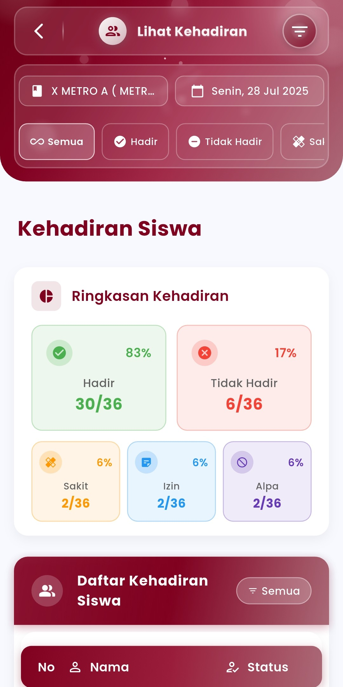
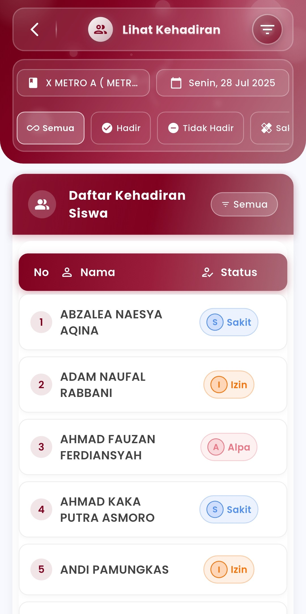

# Laporan Kehadiran Khusus

**Pantau Statistik Kehadiran Siswa dengan Akurat dan Interaktif**

Menu **Laporan Kehadiran** di eSchool Mobile dirancang untuk memudahkan guru dan staf sekolah dalam **melihat rekap kehadiran siswa secara real-time**, lengkap dengan filter data, persentase statistik, dan detail per siswa.

<figure><figcaption></figcaption></figure> <figure><figcaption></figcaption></figure>

#### Fitur Utama:

* **Filter Berdasarkan Kelas & Tanggal**\
  Pilih kelas serta tanggal tertentu untuk menampilkan data kehadiran yang relevan dan terfokus. Ideal untuk laporan harian, mingguan, atau insidental.
* **Ringkasan Visual Kehadiran**\
  Menampilkan grafik ringkasan kehadiran secara langsung dengan persentase dan jumlah siswa untuk setiap kategori:
  * **Hadir**
  * **Sakit**
  * **Izin**
  * **Alpa**
* **Daftar Kehadiran Siswa**\
  Ditampilkan dalam bentuk tabel yang rapi dengan status kehadiran masing-masing siswa, lengkap dengan ikon dan warna berbeda untuk mempercepat identifikasi.
* **Filter Status Khusus**\
  Pengguna dapat memilih untuk hanya menampilkan siswa yang hadir, sakit, izin, atau alpa secara terpisah.
* **Mode Tampilan “Semua”**\
  Untuk meninjau daftar lengkap siswa beserta status kehadirannya pada hari yang dipilih.

#### Manfaat Fitur:

* Memudahkan guru melakukan **analisis kehadiran harian**
* Mempercepat pelaporan ke wali kelas, TU, atau kepala sekolah
* Menyediakan data yang **siap digunakan untuk rekap bulanan atau evaluasi kelas**
* Meminimalisir kesalahan pencatatan melalui sistem otomatis & validasi visual

#### Tips Penggunaan:

* Gunakan filter kelas dan tanggal untuk fokus pada laporan kegiatan tertentu.
* Cocok digunakan sebelum menyusun laporan BK, rapor, atau pembinaan kedisiplinan.
* Data laporan terintegrasi secara langsung dari hasil pencatatan kehadiran yang dilakukan guru di fitur sebelumnya.

***

Jika Anda membutuhkan bantuan lebih lanjut, hubungi kami melalui [halaman Bantuan eSchool](https://www.eschool.ac.id/#contact-us).
