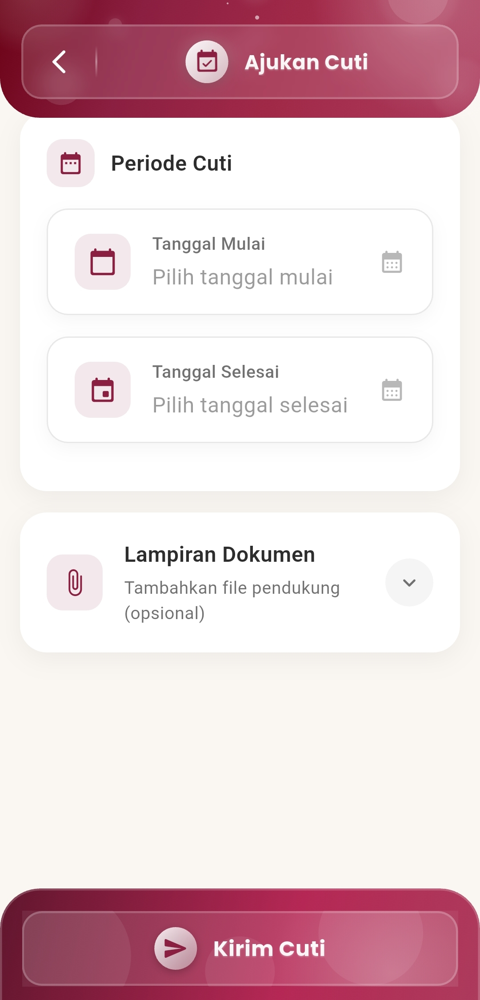

# Ajukan Cuti

**Ajukan Cuti**

#### Proses Pengajuan Cuti Lebih Mudah, Terstruktur, dan Cepat

Menu **Ajukan Cuti** dirancang untuk memudahkan pengguna dalam mengajukan permohonan cuti langsung dari perangkat mobile, tanpa perlu proses manual atau berkas fisik. Dengan antarmuka yang bersih dan terfokus, pengguna dapat mengatur tanggal, melampirkan dokumen pendukung, dan mengirim permohonan dalam satu langkah.

<figure><figcaption></figcaption></figure>

#### **Fitur-Fitur Utama**

**Pilih Periode Cuti**

Pengguna dapat menentukan waktu cuti secara fleksibel melalui dua input tanggal:

* **Tanggal Mulai**: Tentukan hari pertama cuti.
* **Tanggal Selesai**: Pilih hari terakhir masa cuti.

Sistem akan mencatat durasi cuti otomatis sesuai tanggal yang dipilih untuk mempermudah persetujuan administratif.

**Lampiran Dokumen Pendukung (Opsional)**

Tersedia opsi untuk melampirkan file tambahan seperti:

* Surat keterangan dokter
* Bukti perjalanan
* Surat tugas luar

Fitur ini membantu mempercepat proses verifikasi tanpa perlu konfirmasi manual tambahan.

**Kirim Cuti dengan Sekali Tekan**

Setelah semua data terisi, pengguna cukup menekan tombol **“Kirim Cuti”** untuk:

* Mengajukan permohonan ke sistem internal
* Menandai permintaan cuti dalam riwayat data kepegawaian
* Memulai proses persetujuan oleh pihak terkait

Notifikasi akan diterima setelah pengajuan berhasil dikirim.

***

Jika Anda membutuhkan bantuan lebih lanjut, hubungi kami melalui [halaman Bantuan eSchool](https://www.eschool.ac.id/#contact-us).
