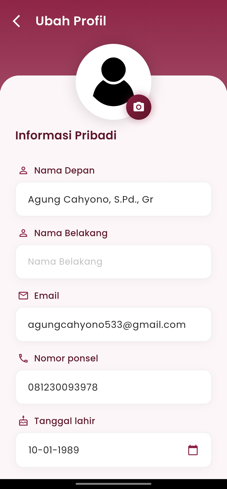
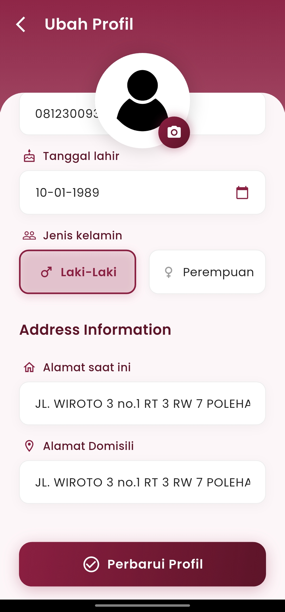

# Edit Profile

#### Perbarui Data Pribadi dengan Mudah dan Cepat

Menu **Ubah Profil** dirancang agar pengguna dapat mengelola informasi pribadinya secara menyeluruh, cepat, dan aman. Dengan tampilan antarmuka yang bersih dan navigasi intuitif, pengguna dapat memperbarui data hanya dalam beberapa langkah.

<figure><figcaption></figcaption></figure> <figure><figcaption></figcaption></figure>

#### **Informasi Pribadi**

Formulir terstruktur dengan isian data seperti:

* **Nama Depan dan Belakang**
* **Email** aktif untuk kebutuhan notifikasi
* **Nomor Ponsel** untuk verifikasi dan kontak darurat
* **Tanggal Lahir** yang dapat dipilih dengan kalender interaktif
* **Jenis Kelamin** dengan pilihan tombol visual

Semua informasi dapat disesuaikan dengan kebutuhan pengguna untuk mencerminkan identitas terkini.

#### **Alamat Lengkap**

Dua kolom terpisah membantu pengguna memasukkan:

* **Alamat Saat Ini** (domisili aktif)
* **Alamat Domisili** (tempat tinggal tetap, jika berbeda)

Tampilan ini mendukung pendataan administratif secara akurat.

#### **Foto Profil**

Pengguna dapat memperbarui foto profil hanya dengan satu kali sentuhan pada ikon kamera yang terletak di atas avatar default.

#### **Simpan Perubahan dengan Aman**

Dengan menekan tombol **"Perbarui Profil"**, seluruh perubahan akan tersimpan ke dalam sistem secara langsung dan tersinkronisasi otomatis ke akun pengguna.

***

Jika Anda membutuhkan bantuan lebih lanjut, hubungi kami melalui [halaman Bantuan eSchool](https://www.eschool.ac.id/#contact-us).

