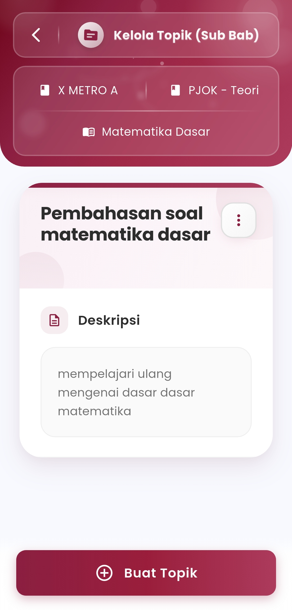
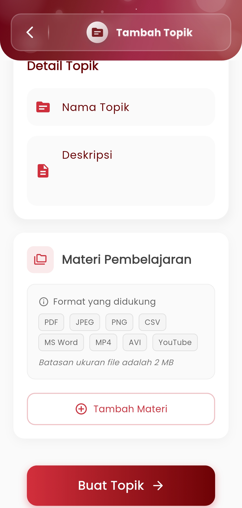

# Kelola Topik (Sub Bab)

**Susun Materi Berdasarkan Sub Bab untuk Pembelajaran yang Lebih Terarah**

Fitur **Kelola Topik (Sub Bab)** memungkinkan guru untuk mengelola dan membagi pelajaran menjadi topik-topik yang lebih spesifik, sesuai struktur kurikulum. Setiap topik dapat dilengkapi dengan deskripsi dan materi pembelajaran dalam berbagai format.

<figure><figcaption></figcaption></figure> <figure><figcaption></figcaption></figure>

\
Fitur Utama:

* **Penambahan Topik atau Sub Bab Baru**\
  Guru dapat membuat topik baru pada suatu bab pelajaran dengan menentukan:
  * **Nama Topik**
  * **Deskripsi Ringkas** mengenai tujuan atau cakupan materi
*   **Upload Materi Pendukung**\
    Setiap topik dapat dilengkapi dengan file pembelajaran seperti:

    * &#x20;PDF, Word, CSV
    * &#x20;Gambar (JPEG, PNG)
    * &#x20;Video (MP4, AVI)
    * &#x20;Tautan YouTube

    > _(Batas maksimal file: 2 MB_

**Preview & Kelola Topik**\
Tampilan daftar topik dilengkapi dengan kolom deskripsi dan lampiran materi yang telah diunggah.

#### Manfaat:

* Mempermudah guru dalam menyusun struktur materi secara bertahap dan terperinci
* Mendorong pembelajaran mandiri siswa melalui akses topik digital
* Memudahkan penyampaian materi saat pembelajaran daring atau blended learning
* Mendukung integrasi multimedia sebagai bagian dari metode pengajaran

#### Tips Penggunaan:

* Gunakan deskripsi yang ringkas namun informatif untuk tiap topik
* Bagi pelajaran panjang ke beberapa topik agar siswa lebih fokus
* Unggah materi yang relevan, jelas, dan terstruktur sesuai urutan pengajaran di kelas

***

Jika Anda membutuhkan bantuan lebih lanjut, hubungi kami melalui [halaman Bantuan eSchool](https://www.eschool.ac.id/#contact-us).
