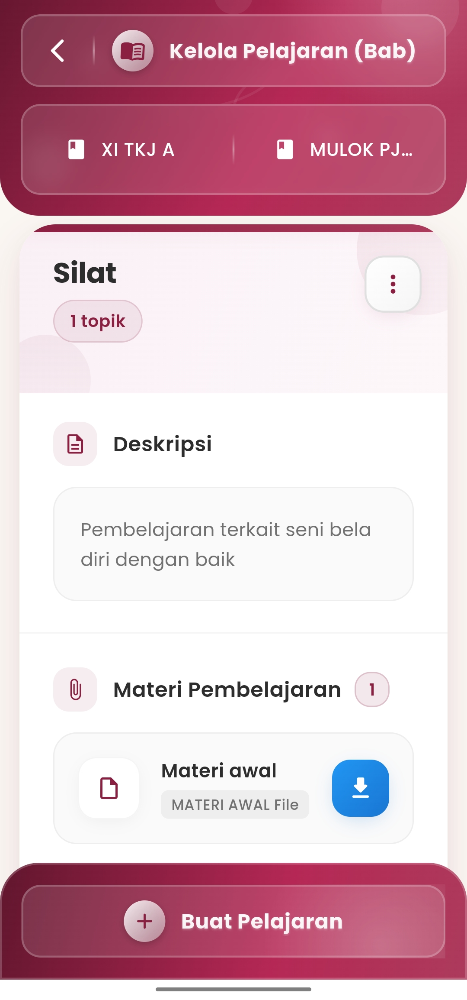
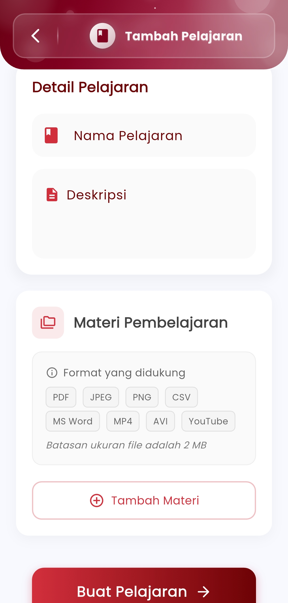

# Kelola Pelajaran (Bab)

**Atur Materi Ajar dan Topik Pembelajaran Secara Terstruktur**

Fitur **Kelola Pelajaran (Bab)** di aplikasi eSchool Mobile memberikan kemudahan bagi guru dalam menyusun dan mengelola materi ajar berdasarkan topik atau bab pembelajaran. Setiap topik dapat dilengkapi dengan deskripsi, lampiran file, hingga video pembelajaran yang terintegrasi langsung dalam aplikasi.

<figure><figcaption></figcaption></figure> <figure><figcaption></figcaption></figure>

#### Fitur Utama:

* **Penambahan Bab atau Topik Baru**\
  Guru dapat membuat pelajaran baru berdasarkan struktur bab, disertai nama topik dan deskripsi singkat tujuan pembelajaran.
*   **Manajemen Materi Pembelajaran**\
    Setiap bab/topik memungkinkan pengunggahan berbagai jenis file pendukung seperti:

    * &#x20;PDF, Word, CSV
    * &#x20;JPEG, PNG
    * &#x20;MP4, AVI, YouTube link

    > _(Batasan ukuran file: 2 MB per item)_
* **Deskripsi Pembelajaran**\
  Kolom deskripsi digunakan untuk memberikan gambaran umum mengenai isi materi, kompetensi yang ditargetkan, atau catatan khusus untuk siswa.
* **Tombol Aksi Cepat**
  * &#x20;**Tambah Materi**: untuk melampirkan file pembelajaran
  * &#x20;**Unduh**: untuk siswa mengakses file yang dibagikan
  * &#x20;**Buat Pelajaran**: menyimpan seluruh bab beserta materinya

#### Manfaat:

* Membantu guru mengorganisir materi ajar secara bertahap dan sistematis
* Memfasilitasi pembelajaran blended (campuran tatap muka dan daring)
* Meningkatkan keterlibatan siswa melalui akses digital terhadap materi
* Mendukung transparansi dan kolaborasi lintas pengajar

#### Tips Penggunaan:

* Gunakan nama pelajaran dan bab yang konsisten dengan silabus sekolah
* Sisipkan media yang beragam agar pembelajaran lebih interaktif
* Perbarui materi secara berkala untuk mengikuti perkembangan kurikulum dan kebutuhan siswa

***

Jika Anda membutuhkan bantuan lebih lanjut, hubungi kami melalui [halaman Bantuan eSchool](https://www.eschool.ac.id/#contact-us).
