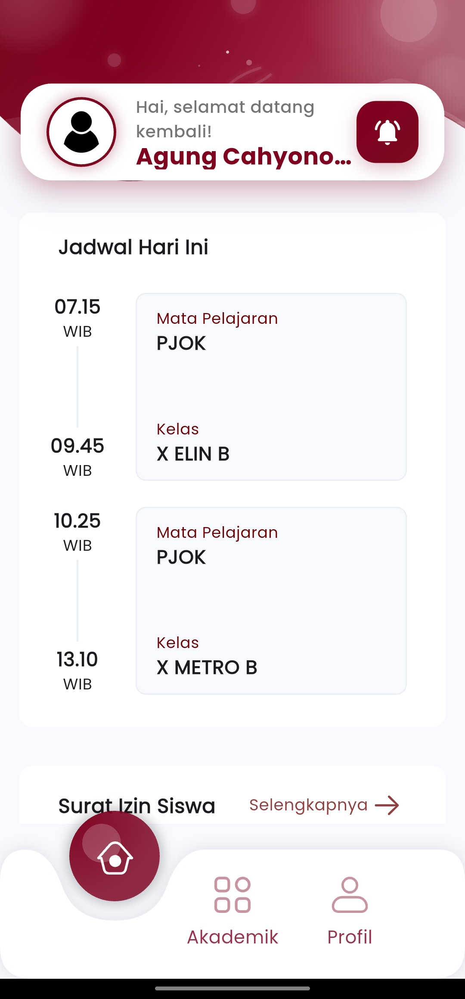
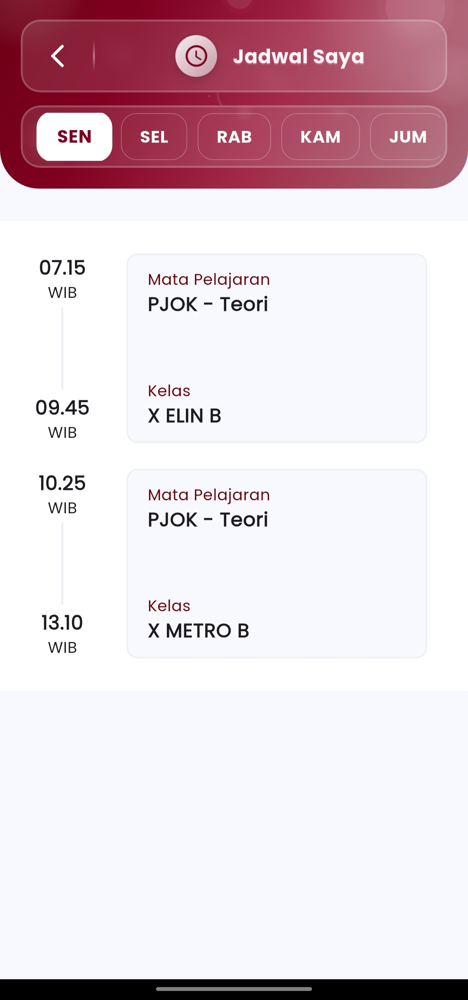

# Jadwal Guru

\
Menu **"Jadwal Guru"** di aplikasi eSchool Mobile adalah fitur khusus bagi guru untuk melihat dan mengelola jadwal mengajar harian secara real-time, langsung dari genggaman.

<figure><figcaption></figcaption></figure> <figure><figcaption></figcaption></figure>

#### Fitur Utama:

* **Navigasi Harian**:\
  Pilih hari aktif (Senin–Jumat) untuk menampilkan jadwal mengajar pada hari tersebut.
* **Rangkaian Waktu yang Jelas**:\
  Jadwal ditampilkan secara vertikal berdasarkan jam, sehingga mudah dibaca dan diikuti.
* **Informasi Lengkap per Sesi**:
  * **Jam Pelajaran** (misal: 07.15 WIB)
  * **Mata Pelajaran** (misal: PJOK – Teori)
  * **Nama Kelas** (misal: X ELIN B atau X METRO B)

#### Manfaat untuk Guru:

* **Akses cepat ke jadwal hari ini dan hari lainnya**
* **Tidak perlu cetak manual atau cek ke papan jadwal sekolah**
* **Selalu siap saat berpindah kelas, bahkan di tengah kegiatan**
* **Membantu manajemen waktu dan persiapan materi ajar**

\
Saran Penggunaan:

* Gunakan fitur ini setiap pagi untuk melihat urutan kelas hari ini.
* Cocok dipasangkan dengan fitur "Tugas & Penilaian" untuk memberi tugas langsung ke kelas setelah sesi selesai.
* Pastikan aplikasi Anda selalu terhubung agar jadwal bisa diperbarui secara otomatis oleh admin sekolah.

***

Jika Anda membutuhkan bantuan lebih lanjut, hubungi kami melalui [halaman Bantuan eSchool](https://www.eschool.ac.id/#contact-us).
