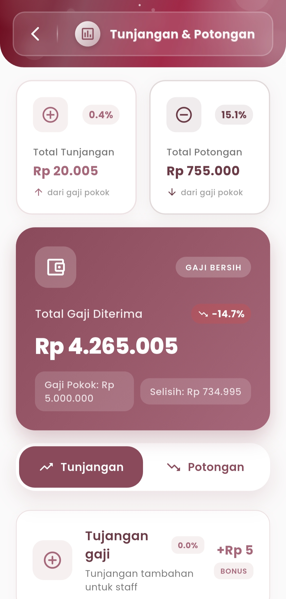
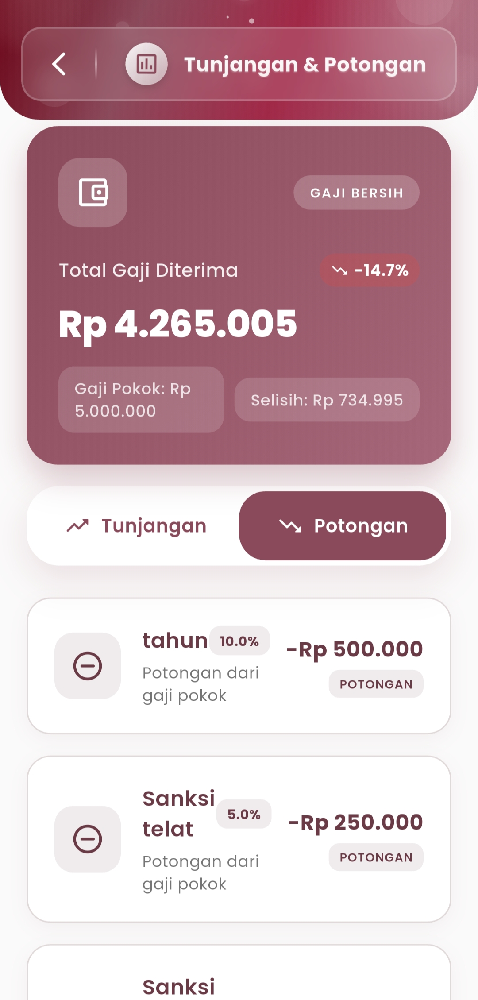

# Tunjangan & Potongan&#x20;

### **Tunjangan & Potongan**

#### Pantau Komponen Tambahan dan Pengurang Gaji Anda Secara Transparan

Menu **Tunjangan dan Potongan** menyajikan informasi terperinci mengenai seluruh tunjangan serta potongan gaji Anda setiap bulan. Dengan antarmuka yang intuitif, pengguna dapat melihat secara langsung pengaruh setiap elemen terhadap total gaji yang diterima.

<figure><figcaption></figcaption></figure> <figure><figcaption></figcaption></figure>

#### **Total Gaji Diterima**

Lihat ringkasan gaji bersih yang Anda terima setelah dihitung dari gaji pokok, ditambah tunjangan, dan dikurangi potongan. Semua angka ditampilkan secara jelas, termasuk persentase perubahan dibandingkan bulan sebelumnya dan selisih yang tercatat.

* **Gaji Pokok**: Dasar perhitungan keseluruhan
* **Selisih**: Perbedaan antara gaji pokok dan gaji bersih
* **Tren**: Indikator naik/turun gaji bersih (misal: -14.7%)

#### **Tab Tunjangan**

Berisi daftar tunjangan aktif yang menambah nominal gaji pokok Anda, seperti:

* **Tunjangan Gaji**: Tambahan penghasilan tetap
* **Bonus Tambahan**: Insentif ekstra (jika tersedia)

Setiap item disertai persentase kontribusi dan total nominal. Ini membantu memahami dari mana tambahan gaji berasal.

#### **Tab Potongan**

Menampilkan semua potongan yang berlaku terhadap gaji pokok, seperti:

* **Potongan Tahunan**
* **Sanksi Keterlambatan**
* **Denda administratif atau lain-lain**

Masing-masing ditandai dengan ikon potong, disertai jumlah dan persentasenya — memastikan tidak ada potongan yang terlewat.

***

Jika Anda membutuhkan bantuan lebih lanjut, hubungi kami melalui [halaman Bantuan eSchool](https://www.eschool.ac.id/#contact-us).
