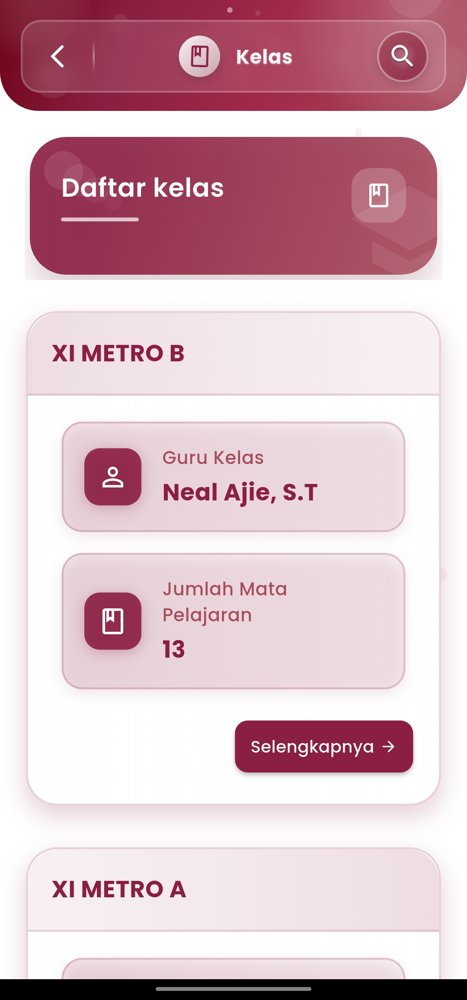
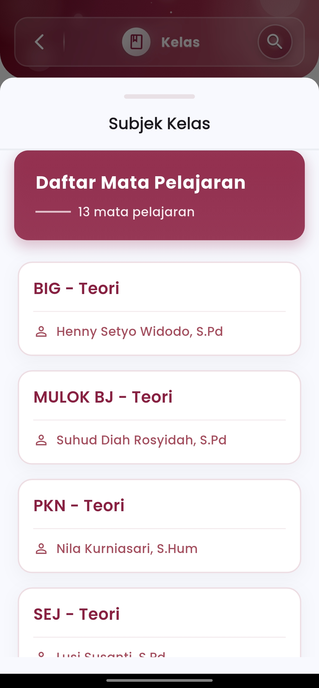

# Kelas

**Kelola & Akses Informasi Kelas dengan Mudah**

Menu **Kelas** di eSchool Mobile memberikan informasi lengkap seputar kelas yang aktif di sekolah, mulai dari nama kelas, wali kelas, hingga daftar mata pelajaran yang diajarkan.

<figure><figcaption></figcaption></figure> <figure><figcaption></figcaption></figure>

#### Fitur Utama:

* **Daftar Kelas Terdaftar**\
  Menampilkan seluruh kelas aktif di sekolah, lengkap dengan nama tingkat dan jurusan (misal: XI METRO A, XI METRO B).
* **Informasi Wali Kelas**\
  Mencantumkan nama guru wali kelas yang bertanggung jawab atas masing-masing kelas, sebagai referensi utama dalam komunikasi dan koordinasi akademik.
* **Jumlah Mata Pelajaran**\
  Menyajikan total mata pelajaran yang diajarkan dalam kelas tersebut, disertai tautan untuk menelusuri detail lebih lanjut.
* **Subjek & Pengampu Mata Pelajaran**\
  Setelah memilih salah satu kelas, pengguna dapat melihat daftar mata pelajaran lengkap berikut nama guru pengampu yang bertugas.

#### Tujuan dan Manfaat:

* Menyediakan referensi cepat bagi guru dan staf akademik mengenai pembagian pengajaran di setiap kelas.
* Mempermudah proses identifikasi wali kelas dan tanggung jawab pengampu mapel.
* Mendukung integrasi lintas fitur seperti penilaian, jadwal, kehadiran, serta laporan kelas.

#### Fitur Pendukung:

* Dilengkapi dengan fungsi **pencarian kelas** untuk mempermudah navigasi.
* Antarmuka yang **responsif dan mobile-friendly**, memungkinkan akses informasi kapan saja dan di mana saja.
* Semua data terintegrasi secara otomatis dengan sistem akademik sekolah.

***

Jika Anda membutuhkan bantuan lebih lanjut, hubungi kami melalui [halaman Bantuan eSchool](https://www.eschool.ac.id/#contact-us).
