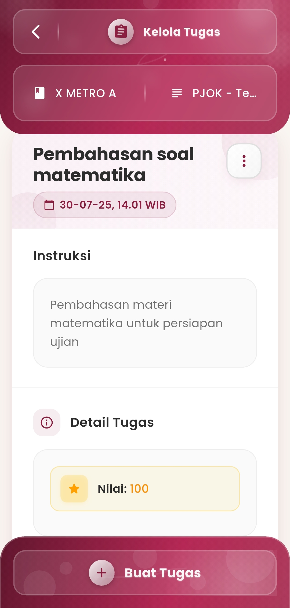
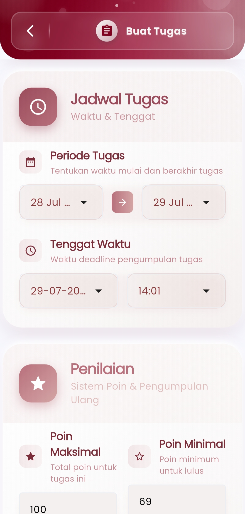
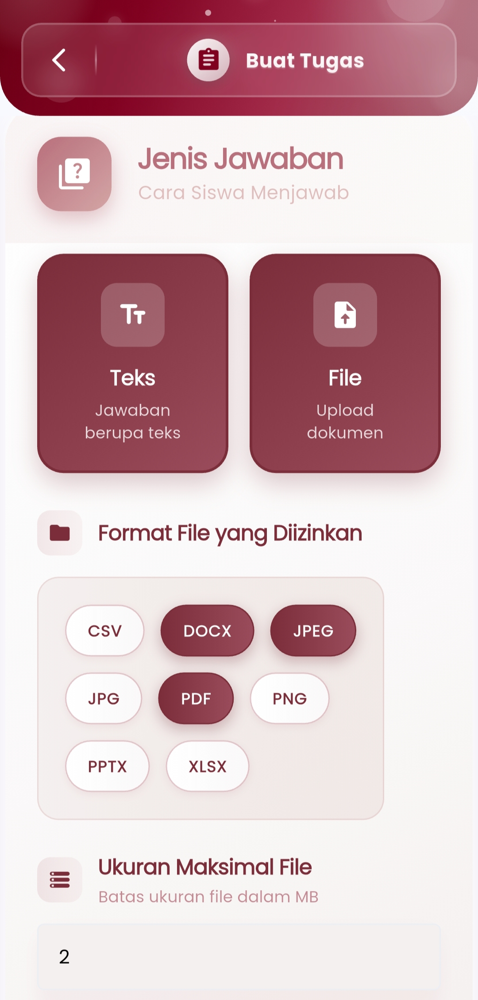
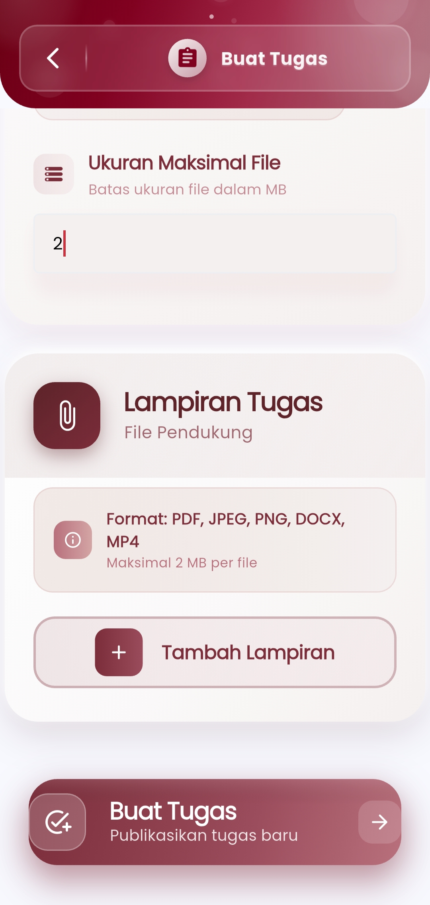

# Kelola Tugas

#### Kontrol Penuh atas Pembuatan, Pengaturan, dan Pemantauan Tugas

Menu **Kelola Tugas** dirancang untuk memberikan kemudahan bagi pendidik dalam menyusun, menjadwalkan, dan mengelola seluruh aktivitas penugasan siswa secara efisien dan terintegrasi. Tampilan antarmuka yang intuitif serta sistematis membantu pengguna untuk menetapkan parameter tugas dengan jelas dan terstruktur.

<figure><figcaption></figcaption></figure> <figure><figcaption></figcaption></figure> <figure><figcaption></figcaption></figure> <figure><figcaption></figcaption></figure>

#### **Fitur-Fitur Utama**

**Jadwal Tugas**

Atur periode tugas dengan menetapkan:

* **Tanggal mulai & akhir tugas**
* **Tenggat waktu pengumpulan** hingga menit yang presisi

Ini memudahkan guru mengelola ritme pembelajaran dan memastikan siswa disiplin terhadap deadline.

**Penilaian Otomatis**

Sistem penilaian fleksibel yang memungkinkan pengaturan:

* **Poin Maksimal** — total skor tertinggi yang bisa didapatkan
* **Poin Minimal** — nilai ambang batas kelulusan
* **Dukungan pengumpulan ulang tugas** (jika diaktifkan)

**Jenis Jawaban**

Pilih metode siswa dalam menjawab:

* **Teks** — ketik langsung jawaban
* **File** — unggah dokumen dengan format yang diizinkan seperti PDF, DOCX, JPEG, dan lainnya

**Lampiran Tugas**

Tambahkan file pendukung (PDF, JPEG, DOCX, MP4, dll.) sebagai referensi atau sumber materi pelengkap dengan batas ukuran maksimal per file yang dapat dikonfigurasi (misalnya 2MB).

**Publikasi Tugas**

Dengan satu kali sentuh tombol **"Buat Tugas"**, guru dapat:

* Mempublikasikan tugas ke kelas atau siswa tertentu
* Meninjau kembali semua parameter sebelum dikirimkan

#### Detail Tugas

Sistem menampilkan informasi ringkas tentang:

* Nama tugas
* Instruksi tugas
* Nilai yang ditetapkan
* Tanggal penerbitan

Tampilan ini memungkinkan guru meninjau dan memperbarui tugas secara cepat dan efisien.

***

Jika Anda membutuhkan bantuan lebih lanjut, hubungi kami melalui [halaman Bantuan eSchool](https://www.eschool.ac.id/#contact-us).
