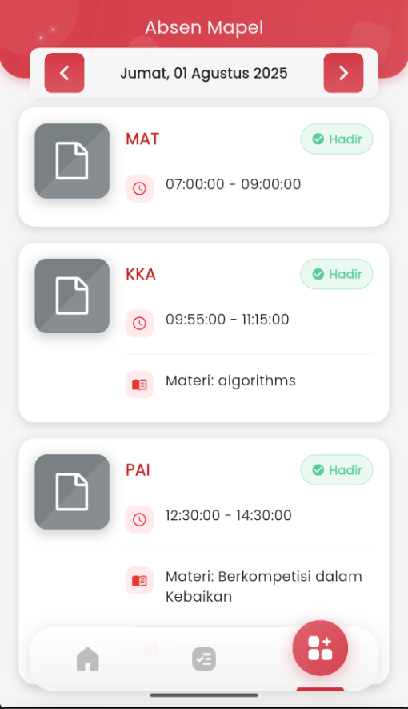

# Absen Mapel

<figure><figcaption></figcaption></figure>

#### **Absen Mapel – Rekap Kehadiran Per Mata Pelajaran**

Halaman **Absen Mapel** dirancang untuk menampilkan riwayat kehadiran siswa secara detail berdasarkan setiap mata pelajaran yang diikuti pada suatu hari. Informasi ini disajikan secara real-time dan terstruktur, sehingga memudahkan siswa memantau keterlibatan mereka dalam pembelajaran harian.

&#x20;**Fitur dan Informasi yang Ditampilkan:**

* **Tanggal dan Hari Aktif**: Ditampilkan di bagian atas dan dapat digeser ke tanggal sebelumnya atau sesudahnya dengan tombol panah, sehingga pengguna bisa melihat absen hari lain.
* **Daftar Mata Pelajaran**: Disusun secara urut berdasarkan jam pelajaran.
* **Nama Mata Pelajaran** (misalnya: MAT, KKA, PAI).
* **Waktu Pelajaran**: Ditampilkan dengan ikon jam (⏰), menandakan jam masuk dan selesai (contoh: 07:00 – 09:00).
* **Status Kehadiran**: Diberi label warna hijau untuk “✅ Hadir”, menegaskan kehadiran siswa pada sesi tersebut.
* **Materi Pelajaran**: Ditampilkan di bawah jam pelajaran, memberi informasi tentang topik pembelajaran yang dibahas guru hari itu (misalnya: _algorithms_, _Berkopetisi dalam Kebaikan_).

&#x20;**Fokus pada Kenyamanan Siswa:**

* Siswa dapat **memantau kehadiran per jam pelajaran**, bukan hanya secara keseluruhan.
* **Materi yang dipelajari** ditampilkan agar siswa tetap terhubung dengan topik yang diajarkan, termasuk untuk mengulas materi jika berhalangan hadir.
* Navigasi intuitif dan cepat untuk melihat absen di hari lain.
* Tampilan visual yang bersih, ikon yang familiar, dan notifikasi kehadiran memudahkan siswa dalam membaca informasi hanya dalam satu pandangan.
