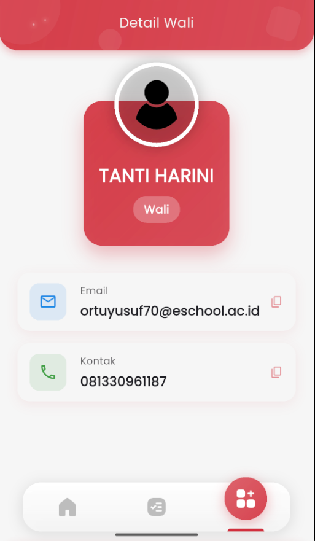

# Detail Wali

<figure><figcaption></figcaption></figure>

### Halaman Detail Wali

Halaman **Detail Wali** menampilkan informasi lengkap mengenai orang tua atau wali yang terhubung dengan akun siswa.

Informasi yang ditampilkan meliputi:

1. **Nama Wali**\
   Ditampilkan di bagian atas dengan label peran sebagai **Wali**.
2. **Email**\
   Alamat email resmi yang digunakan oleh wali untuk login dan menerima notifikasi dari sekolah.\
   Tersedia tombol salin (📋) untuk menyalin email dengan cepat.
3. **Kontak / Nomor Telepon**\
   Nomor telepon aktif milik wali.\
   Tombol salin juga tersedia untuk memudahkan penyalinan kontak.

Halaman ini berguna untuk memverifikasi data orang tua/wali yang terhubung, terutama dalam konteks komunikasi antara sekolah dan keluarga siswa.

***

💡 _Catatan:_ Jika terdapat kesalahan pada data wali, silakan hubungi pihak sekolah agar dapat dilakukan pembaruan melalui admin sekolah.
