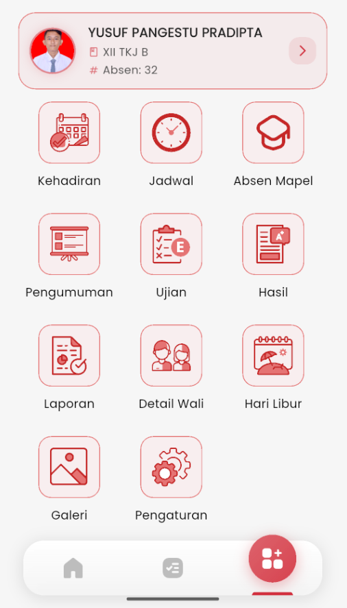

# Profile Siswa

<figure><figcaption></figcaption></figure> <figure><figcaption></figcaption></figure>

### Profil Siswa

Untuk melihat detail informasi pribadi siswa, ikuti langkah berikut:

1. Buka aplikasi **eSchool Mobile**, lalu buka halaman utama.
2. Di bagian atas, kamu akan melihat **kartu identitas siswa** lengkap dengan nama, kelas, dan nomor absen.
3. Ketuk **ikon panah kanan (›)** pada kartu tersebut untuk masuk ke halaman **Profil**.

***

#### Informasi yang Ditampilkan:

* **Foto dan Nama Lengkap Siswa**
* **Nomor Pendaftaran (NISN / NIPD)** – dapat **disalin** dengan sekali ketuk
* **Sekolah** – nama dan kode sekolah
* **Kelas & Jurusan**
* **Absensi**
* **Tanggal Lahir**
* **Alamat** – saat diklik, akan terbuka langsung di **Google Maps**

***

📌 _Catatan:_ Jika terdapat ketidaksesuaian pada data, harap segera laporkan ke pihak sekolah untuk dilakukan pembaruan melalui admin eSchool.
