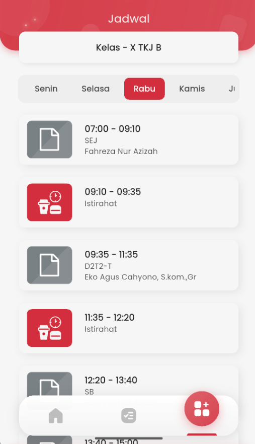

# Jadwal Pelajaran Harian

<figure><figcaption></figcaption></figure>

Di halaman **Jadwal**, Anda dapat melihat susunan pelajaran berdasarkan hari dalam seminggu. Tampilan ini membantu siswa mengetahui pelajaran apa saja yang harus diikuti hari itu, siapa gurunya, dan kapan jam istirahat berlangsung.

#### Navigasi Hari

Bagian atas halaman dilengkapi dengan tab hari: **Senin, Selasa, Rabu, Kamis, Jumat, Sabtu**. Cukup ketuk hari yang diinginkan, maka daftar pelajaran untuk hari tersebut akan langsung ditampilkan.

#### Informasi Jadwal

Setiap sesi ditampilkan dalam bentuk kartu berisi:

* ⏰ Waktu pelajaran (misalnya: 07:00 – 09:10)
* 📖 Nama mata pelajaran (contoh: SEJ, SB)
* 👩‍🏫 Nama guru pengampu
* ☕️ Kartu khusus bertuliskan _Istirahat_ akan muncul di antara pelajaran, agar siswa tahu kapan waktu istirahat dimulai dan selesai.

#### Kelas yang Difilter Otomatis

Jadwal yang tampil sudah difilter otomatis sesuai kelas Anda. Di bagian atas, akan terlihat label seperti **“Kelas – X TKJ B”**, sehingga Anda tidak perlu memilih kelas secara manual.

Dengan tampilan yang rapi dan responsif, fitur ini dirancang agar siswa mudah memahami susunan pelajaran, mempersiapkan diri, dan mengatur waktu belajarnya setiap hari — langsung dari genggaman.
