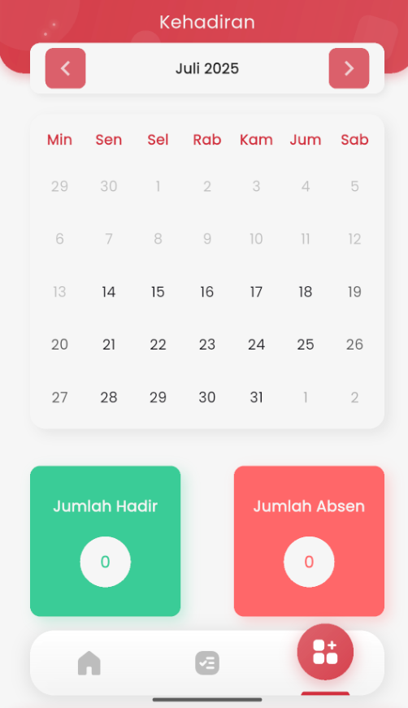

# Kehadiran Siswa

<figure><figcaption></figcaption></figure>

Halaman **Kehadiran** pada aplikasi eSchool Mobile dirancang untuk membantu siswa memantau riwayat kehadiran mereka setiap bulannya secara mandiri. Fitur ini memberikan gambaran visual yang sederhana namun informatif mengenai catatan kehadiran harian di sekolah.

#### Navigasi Kalender

Siswa dapat berpindah bulan menggunakan ikon panah kanan dan kiri di bagian atas. Kalender ditampilkan dalam format bulanan agar siswa dapat melihat aktivitas kehadiran secara menyeluruh.

#### Indikator Kehadiran Harian

Setiap tanggal dalam kalender menampilkan status kehadiran. Biasanya ditandai dengan warna atau simbol tertentu (sesuai implementasi), misalnya:

* 🟢 Hadir
* 🔴 Absen
* 🟡 Izin
* ⚪️ Kosong (tidak ada data)

#### Ringkasan Kehadiran Bulanan

Di bawah kalender, terdapat dua kartu informasi:

* **Jumlah Hadir**: Total hari siswa hadir selama bulan tersebut.
* **Jumlah Absen**: Total ketidakhadiran siswa di bulan tersebut.

Fitur ini membantu siswa lebih bertanggung jawab terhadap kehadiran mereka dan memberikan kesadaran terhadap tingkat kedisiplinan yang tercatat di sistem sekolah.
