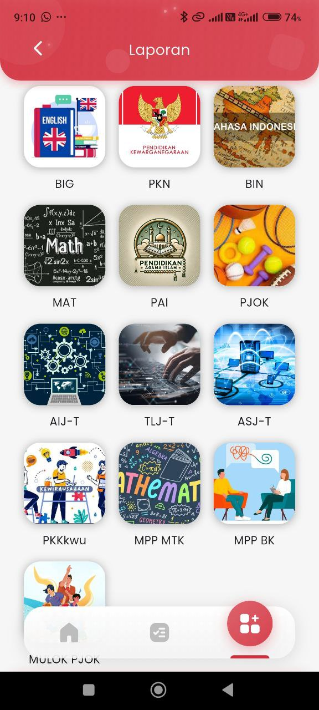

# Laporan

<figure><figcaption></figcaption></figure>

### **Halaman Laporan – Pilih Mata Pelajaran**

Pada halaman ini, pengguna dapat mengakses **laporan perkembangan akademik** berdasarkan masing-masing mata pelajaran.

&#x20;Sebelum melihat detail laporan seperti penugasan dan ujian daring, pengguna **harus memilih salah satu mata pelajaran** terlebih dahulu.

#### &#x20;Deskripsi Tampilan:

* Setiap mata pelajaran ditampilkan dalam bentuk **ikon kotak bergambar** disertai kode mapel singkat (contoh: BIG, PKN, BIN, MAT, PJOK).
* Desain disusun secara **grid 3 kolom**, sehingga memudahkan siswa maupun orang tua dalam mencari mapel dengan cepat.
* Daftar mata pelajaran mencakup semua jenis bidang studi, baik umum maupun kejuruan (contoh: AIJ-T, TLJ-T, PKKKwu, MPP MTK, MPP BK).

#### &#x20;Catatan Tambahan:

* Tampilan ini **berfungsi sebagai gerbang awal** sebelum masuk ke tampilan detail laporan.
* Setelah mapel dipilih, pengguna akan diarahkan ke halaman laporan spesifik yang terdiri dari dua tab utama: **Penugasan** dan **Ujian Daring**.
