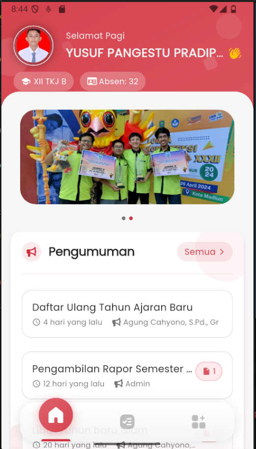
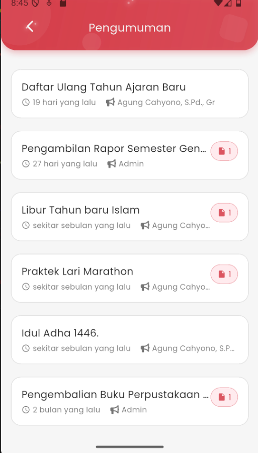

# Pengumuman

<figure><figcaption></figcaption></figure> <figure><figcaption></figcaption></figure>

### Melihat Pengumuman Sekolah

Fitur **Pengumuman** di eSchool Mobile memudahkan siswa untuk mengetahui informasi terbaru dari sekolah secara langsung melalui aplikasi.

#### Akses Pengumuman

1. Dari **halaman utama**, kamu akan melihat bagian **Pengumuman** tepat di bawah kartu identitas siswa.
2. Beberapa pengumuman terbaru akan langsung ditampilkan di sana, lengkap dengan:
   * Judul pengumuman
   * Waktu diterbitkan (misalnya: 4 hari yang lalu)
   * Nama pengirim (guru atau admin)
   * Ikon 📎 jika terdapat lampiran
3. Untuk melihat semua pengumuman, ketuk tombol **"Semua >"** di pojok kanan atas.

***

#### Tampilan Halaman Pengumuman

Di halaman penuh pengumuman, kamu akan menemukan daftar lengkap pengumuman berdasarkan waktu, mulai dari yang terbaru. Informasi yang ditampilkan di setiap item meliputi:

* Judul pengumuman
* Tanggal/waktu pengumuman diterbitkan
* Nama pengirim
* Ikon lampiran jika ada file yang dapat diunduh

***

📌 _Catatan:_ Jika pengumuman berisi lampiran, kamu bisa mengetuk ikon 📎 untuk melihat atau mengunduh file yang disediakan (misalnya surat pemberitahuan, jadwal, atau formulir).

***

Fitur ini memastikan seluruh siswa mendapatkan informasi penting seperti:

* Daftar ulang
* Jadwal pembagian rapor
* Hari libur
* Kegiatan sekolah
* Informasi penting lainnya
