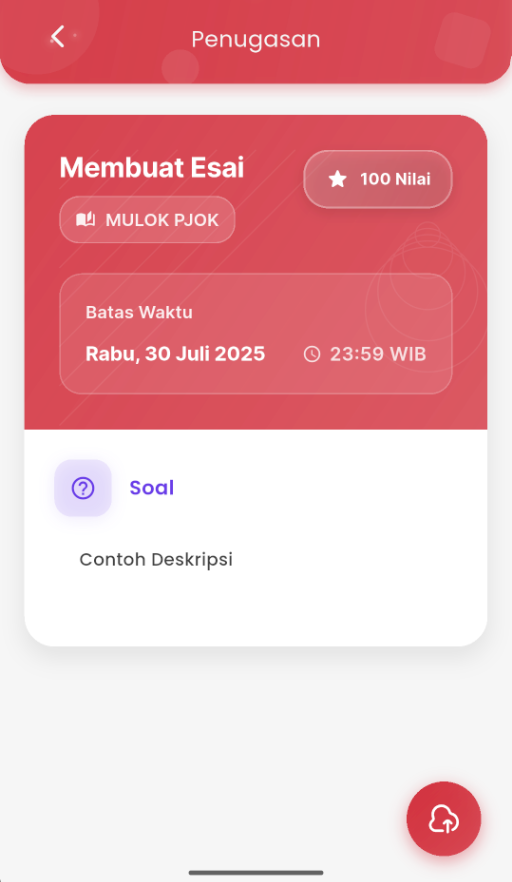
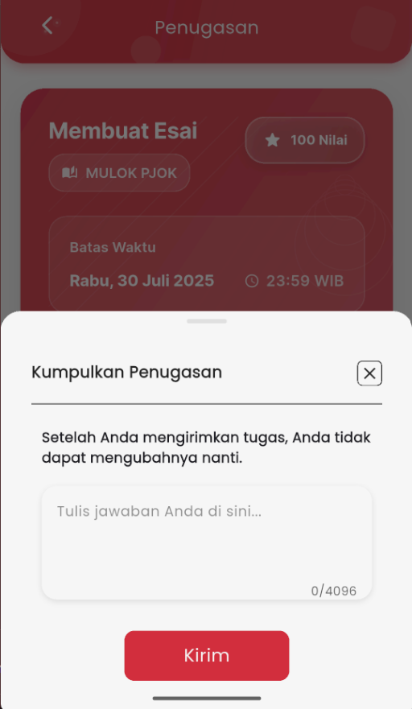
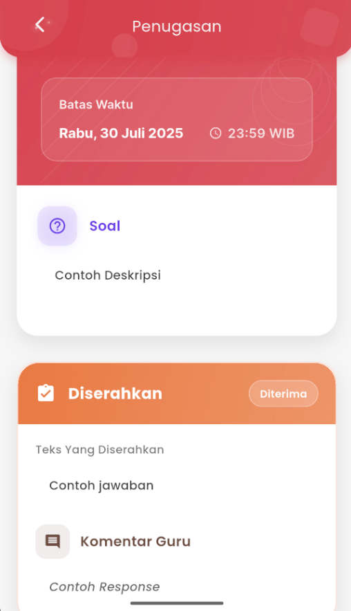

# Penugasan

<figure><figcaption></figcaption></figure> <figure><figcaption></figcaption></figure> <figure><figcaption></figcaption></figure>

### &#x20;Mengerjakan dan Mengumpulkan Tugas

Untuk mengerjakan tugas di eSchool Mobile, ikuti langkah-langkah berikut:

1. Di halaman penugasan, Anda akan melihat:
   * Nama mata pelajaran
   * Nilai maksimum
   * Batas waktu pengumpulan
   * Deskripsi atau instruksi dari guru
2. Tekan tombol **Kumpulkan Tugas** dipojok kanan bawah untuk membuka formulir pengumpulan.
3. Ketik jawaban Anda di kolom yang tersedia (maks. 4096 karakter) atau uploadd tugas jika diperlukan dalam bentuk dokumen.
4. Tekan tombol **Kirim** untuk menyelesaikan proses pengumpulan.

⚠️ Setelah tugas dikirim, **Anda tidak dapat mengubah jawaban**.

7. Setelah berhasil dikumpulkan, status tugas akan berubah menjadi **Diserahkan** dengan label **Menunggu**.
8. Jika tugas diterima maka status tugas akan berubah menjadi **Diterima** dengan **komentar** serta **nilai** yang didapat.
9. Anda dapat melihat kembali:
   * Jawaban yang telah dikirim
   * Komentar atau tanggapan dari guru (jika tersedia)

***

Fitur penugasan ini memudahkan siswa untuk mengerjakan tugas tepat waktu dan memastikan semua proses tercatat dengan baik langsung dari aplikasi mobile.

Jika mengalami kendala saat mengirim tugas, hubungi pihak sekolah atau kunjungi Halaman Bantuan eSchool.
