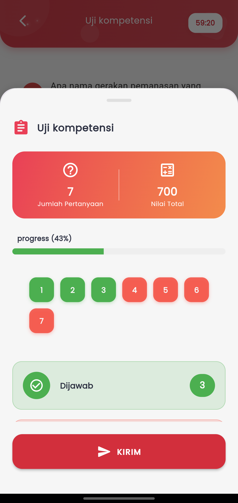

# Ujian

<figure><figcaption></figcaption></figure>

**Kerjakan Soal Lebih Aman dan Terstruktur dengan Kontrol Penuh**

Fitur **Ujian** di aplikasi eSchool Mobile dirancang untuk memberikan pengalaman ujian digital yang nyaman, aman, dan disiplin. Tampilan antarmuka menyajikan seluruh elemen penting dalam satu layar agar siswa tetap fokus selama mengerjakan soal.

**Informasi yang Ditampilkan:**

* **Jumlah Pertanyaan & Nilai Maksimal**\
  Siswa dapat langsung melihat berapa banyak soal yang harus diselesaikan serta nilai total yang bisa diperoleh.
* **Progress Bar Pengerjaan**\
  Menampilkan persentase soal yang telah dijawab untuk memantau progres secara visual.
* **Navigasi Antar Soal dengan Indikator Warna**\
  Soal-soal ditampilkan dalam bentuk tombol bernomor:
  * Hijau: sudah dijawab
  * Merah: belum dijawab\
    Siswa dapat langsung mengetuk nomor soal untuk berpindah.
* **Rekap Jumlah Soal yang Dijawab**\
  Jumlah soal yang telah diisi ditampilkan secara langsung sebelum pengumpulan, agar siswa bisa mengecek kembali.
* **Tombol Kirim**\
  Setelah semua siap, siswa dapat mengirim hasil ujian dengan tombol **KIRIM** di bagian bawah. Setelah dikirim, jawaban tidak bisa diubah.

***

#### 🔐 Mekanisme Keamanan Ujian

Untuk menjaga integritas ujian dan mencegah kecurangan, sistem menerapkan beberapa aturan penting berikut:

* &#x20;**Screenshot Dinonaktifkan**\
  Siswa tidak dapat mengambil tangkapan layar selama ujian berlangsung.
* &#x20;**Alarm Aktif saat Keluar Aplikasi**\
  Jika siswa keluar dari aplikasi selama ujian berlangsung, sistem akan langsung memunculkan **alarm peringatan**.
* &#x20;**Auto-Submit Jika Tidak Kembali dalam 5 Detik**\
  Jika siswa tidak kembali ke aplikasi dalam waktu **lebih dari 5 detik**, maka sistem akan secara otomatis **mengirim hasil ujian** meskipun belum selesai.
