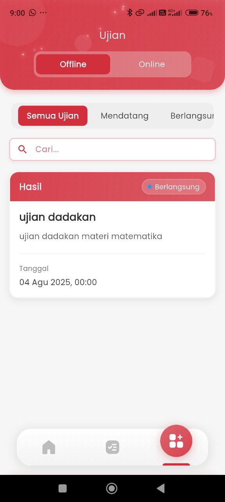
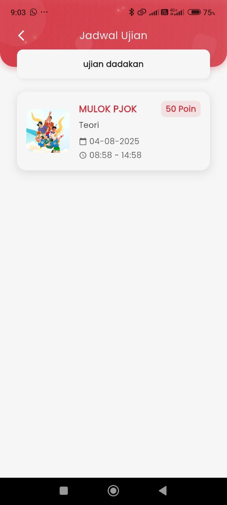

# Ujian Offline

<figure><figcaption></figcaption></figure> <figure><figcaption></figcaption></figure>

### Ujian Offline

Fitur ini menampilkan seluruh daftar ujian offline yang telah dijadwalkan oleh sekolah. Orang tua dapat memantau jadwal ujian anak beserta detail penting lainnya secara praktis dan akurat.

#### &#x20;Tampilan Jadwal Ujian

Pada halaman ini, orang tua dapat melihat:

* **Nama Ujian**\
  Judul ujian seperti _“ujian dadakan”_ akan muncul di bagian atas, memudahkan identifikasi.
* **Mata Pelajaran & Jenis Ujian**\
  Contohnya: _MULOK PJOK – Teori_, menandakan ujian pada mata pelajaran muatan lokal PJOK dengan tipe teori.
* **Tanggal Ujian**\
  Informasi tanggal pelaksanaan seperti _04 Agustus 2025_ ditampilkan secara jelas.
* **Waktu Pelaksanaan**\
  Rentang waktu ujian, seperti _08:58 – 14:58_, memudahkan orang tua mengetahui durasi keberlangsungan ujian.
* **Bobot Nilai / Poin Ujian**\
  Misalnya _50 Poin_, menunjukkan total nilai maksimal yang dapat diperoleh siswa pada ujian tersebut.

***

#### &#x20;Status Pelaksanaan

Halaman ini juga menampilkan status terkini dari setiap ujian:

* **Keterangan Ujian**\
  Menampilkan deskripsi singkat seperti _“ujian dadakan materi matematika”_.
* **Waktu Dimulai**\
  Ditunjukkan dengan format tanggal dan jam, seperti _04 Agustus 2025, 00:00_.
* **Status Ujian**\
  Terdapat indikator status seperti **“🔵 Berlangsung”**, yang memberi tahu bahwa ujian sedang aktif dilaksanakan.
