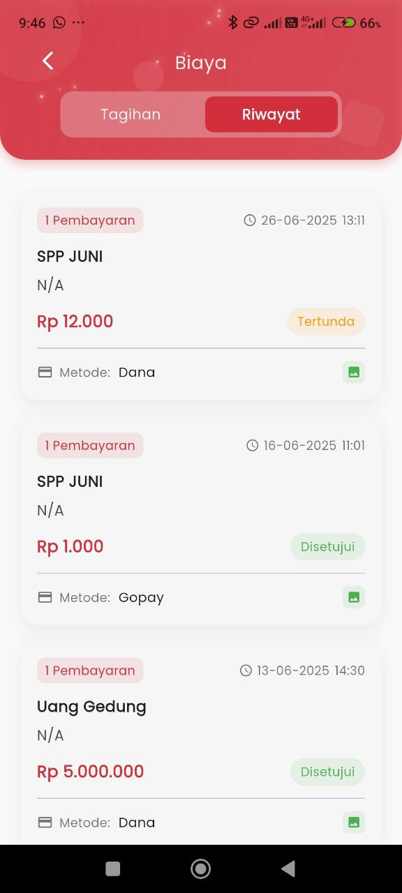

# Riwayat

<figure><figcaption></figcaption></figure>

### **Riwayat Pembayaran**

Halaman **Riwayat** pada fitur **Biaya** memberikan rekap lengkap semua transaksi pembayaran yang telah dilakukan oleh pengguna, baik yang sudah disetujui maupun yang masih tertunda. Informasi disajikan secara rapi dan mudah dibaca untuk membantu pengguna melacak riwayat kontribusi biaya pendidikan siswa.

#### &#x20;**Informasi yang Ditampilkan:**

Setiap item riwayat menampilkan detail berikut:

* **Jenis Pembayaran**: Misalnya “SPP JUNI” atau “Uang Gedung”
* **Jumlah Nominal**: Total biaya yang dibayarkan (dalam format mata uang Indonesia)
* **Status Pembayaran**:
  * 🟢 **Disetujui** → Pembayaran sudah berhasil diverifikasi.
  * 🟡 **Tertunda** → Pembayaran masih dalam proses konfirmasi.
* **Tanggal & Waktu Pembayaran**: Kapan transaksi dilakukan.
* **Metode Pembayaran**: Seperti Dana, Gopay, dll.
* **Ikon Bukti Transfer**: Tersedia ikon untuk melihat bukti pembayaran.

#### &#x20;**Contoh Transaksi:**

1. **SPP JUNI**
   * Rp 12.000 – _Tertunda_
   * Metode: Dana
   * Tanggal: 26-06-2025 13:11
2. **SPP JUNI**
   * Rp 1.000 – _Disetujui_
   * Metode: Gopay
   * Tanggal: 16-06-2025 11:01
3. **Uang Gedung**
   * Rp 5.000.000 – _Disetujui_
   * Metode: Dana
   * Tanggal: 13-06-2025 14:30

***

#### &#x20;**Manfaat Fitur Ini**

* Memberikan transparansi dan dokumentasi lengkap setiap pembayaran.
* Mempermudah pengguna (terutama orang tua/wali) untuk mengontrol status keuangan sekolah.
* Menyediakan bukti transaksi yang bisa diakses kapan saja jika dibutuhkan untuk keperluan administrasi.
